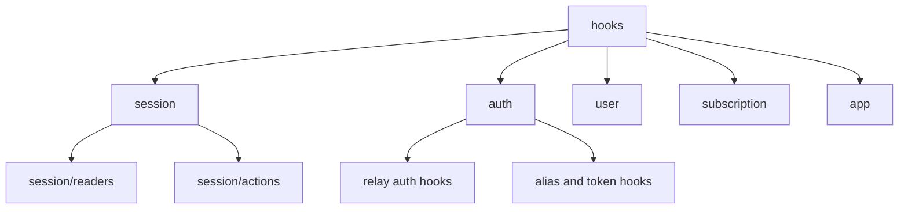

# Hooks Layer

## 목적

`hooks`는 `web-core` 외부 소비자가 세션과 도메인 기능을 읽고 요청하는 유일한 React 진입점입니다.

이 문서의 기본 원칙은 다음과 같습니다.

- 외부에서 읽을 수 있는 것은 `hook`과 `sessionContext`뿐입니다
- 외부에서 `...Core`, `transport`, 내부 store, service를 직접 읽으면 안 됩니다
- hook은 도메인별 폴더로 분류하고, 각 폴더 하위에 기능 단위 hook을 둡니다

## 현재 문제

현재 구조는 아래 문제가 있습니다.

- `hooks/index.ts`가 여전히 넓은 surface를 re-export 합니다
- 일부 hook은 호환성 alias 성격이라 이름과 실제 책임이 완전히 일치하지 않습니다
- `session/index.ts`는 실제 파일 구조와 stale export가 섞일 여지가 있어 지속적인 점검이 필요합니다

## 설계 원칙

### 1. 외부 읽기 진입점은 hook + sessionContext만 허용

허용:

- `useGlobalSession()`
- `useSessionAuth()`
- `useSessionIdentity()`
- `useSessionSelection()`
- 각 도메인 hook
- `getGlobalSessionContext()` 및 하위 session context getter

비허용:

- `cloudCore`, `relayCore`, `identityCore` 직접 접근
- `transport` 직접 접근
- `session/services` 직접 접근
- 내부 store나 signal 직접 접근

### 2. Hook은 도메인별 폴더 아래에 둔다

권장 구조:

```text
hooks/
  index.ts
  session/
    index.ts
    readers/
      useGlobalSession.ts
      useSessionAuth.ts
      useSessionIdentity.ts
      useSessionSelection.ts
      useCloudSessionCatalog.ts
    actions/
      useLogoutCloudSession.ts
      useLogoutRelaySession.ts
      useRefreshCloudSiteSession.ts
      useRefreshRelaySession.ts
      useRestoreInvitedCloudSession.ts
      useSessionLogout.ts
      useSwitchCloudSession.ts
  auth/
    index.ts
    useFindAlias.ts
    useIssueCloudToken.ts
    useIssueToken.ts
    useLogin.ts
    useLoginRelayGuestByDevice.ts
    useLoginRelaySocial.ts
    useLoginWithInviteCode.ts
    useRefreshCloudToken.ts
    useRegisterUser.ts
    useRegisterUserV2.ts
    useVerifyAlias.ts
  user/
    index.ts
    useClouds.ts
    useProfile.ts
    useRegisterDeviceToken.ts
    useUpdateCloud.ts
    useUpdateProfile.ts
    useUsers.ts
    useVerifyEmail.ts
    useVerifyNativeAppToken.ts
  subscription/
    index.ts
  app/
    index.ts
    useInitWebCore.ts
    useTokenRefresh.ts
    useServiceUnavailable.ts
```

원칙:

- 폴더는 도메인
- 파일은 기능 단위 hook
- `index.ts`는 해당 도메인에서 공개할 hook만 export

### 3. Hook은 읽기와 요청 연결만 담당

hook의 책임:

- React state/subscribe 연결
- session service 호출용 adapter
- query/mutation 구성
- UI 친화적인 조합 반환

hook의 비책임:

- 세션 상태 직접 변경
- `...Core` 직접 변경
- transport 직접 호출
- 도메인 규칙 계산

## 권장 공개 Surface

### session domain

유지 권장:

- `useGlobalSession()`
- `useSessionAuth()`
- `useSessionIdentity()`
- `useSessionSelection()`
- `useCloudSessionCatalog()`
- `useSessionLogout()`
- `useRefreshRelaySession()`
- `useLogoutCloudSession()`
- `useRefreshCloudSiteSession()`
- `useRestoreInvitedCloudSession()`
- `useSwitchCloudSession()`

정리 필요:

- `useCloudSessionCatalog.ts`는 현재 위치가 `session/readers`이지만, 성격상 `user` 도메인으로 이동할 여지가 큽니다
- `useLogoutRelaySession.ts`와 `useSessionLogout.ts`는 의미가 가까워 이름/책임을 하나로 수렴할지 판단이 필요합니다
- session facade hook(`useCloudSession`, `useAutoSelectCloud`, `useDelegatorId`, `useDynamicProfile`)은 현재 구조에서 제거되었거나 이동되었으므로, 신규 문서 기준에서는 더 이상 기본 공개면으로 다루지 않습니다

### auth domain

유지 권장:

- relay/cloud 인증 관련 mutation hook
- alias 검증 관련 mutation hook

정리 필요:

- `useLogin`과 `useIssueToken`은 둘 다 relay login 계열이라 책임 차이를 문서로 분명히 해야 합니다
- `useRefreshCloudToken`은 raw auth utility hook이라 session action hook과 구분해야 합니다

권장 방향:

- `useLoginRelayGuestByDevice`
- `useLoginRelaySocial`
- `useLoginWithInviteCode`
- `useIssueToken`
- `useRefreshCloudToken`
- `useVerifyAlias`

### user domain

유지 권장:

- user/cloud 조회 및 수정 관련 query/mutation hook
- push/device token 등록 hook

### subscription domain

유지 권장:

- `subscription/index.ts`를 통해 공개되는 subscription query/mutation hook

### app domain

- `useServiceUnavailable`
- `useInitWebCore`
- `useTokenRefresh`

현재 판단:

- `useInitWebCore`는 app bootstrap lifecycle에 속하므로 현재 위치가 맞습니다
- `useTokenRefresh`도 interval/visibility/runtime lifecycle 때문에 `app` 위치가 맞습니다
- 다만 `useTokenRefresh` 내부의 세션 복구 규칙은 계속 `session/services` 쪽으로 더 내려야 합니다

## 제거 또는 축소 후보

### 1. 루트 level hook 파일 남용

현재 방향:

- 루트에는 `index.ts`만 둡니다
- 실제 hook 파일은 `app`, `auth`, `session`, `subscription`, `user` 아래로 이동합니다
- `session`은 다시 `readers`, `actions`로 세분화합니다

판단:

- 이 구조는 현재 코드에 반영되었습니다
- 남은 정리 대상은 `session/index.ts`의 export 정제와 일부 파일의 도메인 재배치입니다

### 2. session/index.ts에서 hook 재-export

현재 `session/index.ts`는 session public API를 제공하는 계층이고, hook은 `hooks/session/index.ts`를 통해 따로 공개하는 방향이 맞습니다.

문서 규칙:

- `src/session/index.ts`는 session context/service/type만 공개합니다
- `src/hooks/session/index.ts`는 React hook만 공개합니다
- 두 surface를 서로 다시 re-export 하지 않습니다

### 3. 내부 setter 노출

아래 계열은 외부 공개 surface에서 줄여야 합니다.

- `setSessionAuthenticated`
- `setSessionIdentityState`
- `setSessionProfile`
- `clearSessionProfile`

이 값들은 hook이나 외부 feature가 직접 다루는 것이 아니라 service 내부에서만 사용되는 방향이 맞습니다.

## 권장 도메인 분류안



## 검토 포인트

- `session/readers/useCloudSessionCatalog.ts`를 `user` 도메인으로 옮길지
- `useLogoutRelaySession.ts`와 `useSessionLogout.ts`를 하나로 수렴할지
- `useTokenRefresh`의 세션 복구 규칙을 얼마나 service로 내릴지
