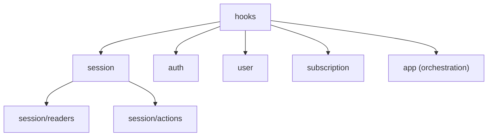

# Hooks Layer

## 목적

`hooks`는 `web-core` 외부 소비자가 세션·도메인 기능을 읽고 요청하는 React 진입점입니다.

원칙:

- 외부에서 읽는 것은 `hook`과 `sessionContext` getter뿐입니다.
- 외부에서 `...Core`/`transport`/내부 store/`session/services`를 직접 읽지 않습니다.
- hook은 도메인 폴더로 분류하고, `session`은 다시 **readers**(구독 read)와 **actions**(전이 mutation)로 나눕니다.

## 분류 원칙

hook은 **도메인 + 역할**로 나뉩니다.

- **session/** — `readers/`(`useSyncExternalStore` 기반 상태 getter)와 `actions/`(react-query mutation / 콜백, `session/services`를 통해 전이 구동)로 분리.
- **app/** — 앱 부트스트랩 시 1회 마운트되어 lifecycle/loop 정책을 구동하는 orchestration hook. 마운트·interval·visibility 이벤트에 service 전이를 트리거만 하고 전이 자체는 소유하지 않습니다.
- **auth/·user/·subscription/** — raw query/mutation hook의 평면 폴더. session 변경분은 `session/services`를, 순수 query/verify/register는 `api`를 호출.

## 현재 폴더 구조

```text
hooks/
  index.ts
  session/
    index.ts
    readers/
      useGlobalSession.ts
      useSessionAuth.ts
      useSessionIdentity.ts
      useSessionSelection.ts
    actions/
      useSiteSwitch.ts
      useSwitchCloudSession.ts
      useSessionLogout.ts
      useLogoutCloudSession.ts
      useRefreshRelaySession.ts
      useRefreshCloudSiteSession.ts
      useRefreshCurrentCloudSession.ts
      useInviteFlow.ts
  auth/
    index.ts
    useFindAlias.ts
    useVerifyAlias.ts
    useInviteInfo.ts
    useLogin.ts
    useLoginRelayGuestByDevice.ts
    useLoginRelaySocial.ts
    useRegisterUser.ts
    useRegisterUserV2.ts
  user/
    index.ts
    useClouds.ts
    useCloudSessionCatalog.ts
    useRegisterDeviceToken.ts   # useRegisterDeviceTokenMutation
    useUsers.ts
    useVerifyEmail.ts
    useVerifyNativeAppToken.ts
  subscription/
    index.ts
  app/
    index.ts
    useInitWebCore.ts
    useRelaySessionKeepAlive.ts
    useServiceUnavailable.ts
    useDynamicDeviceId.ts
    useRegisterDeviceToken.ts
```

- 폴더=도메인, 파일=기능 단위 hook, 각 `index.ts`는 공개 hook만 export.
- 초대 인증은 별도 `useLoginWithInviteCode` hook이 아니라 `useInviteFlow`가 **api `registerUserWithInviteCode`를 직접 호출**합니다(인증만; cloud/site 진입은 소비자).

## hook의 책임 / 비책임

책임: React state/subscribe 연결, service 호출 adapter, query/mutation 구성, UI 친화 조합 반환.

비책임: 세션 상태 직접 변경, `...Core` 직접 변경, transport 직접 호출, 도메인 규칙 계산.

## 도메인별 공개 표면

### session

- readers: `useGlobalSession` · `useSessionAuth` · `useSessionIdentity` · `useSessionSelection`
- actions: `useSiteSwitch` · `useSwitchCloudSession` · `useSessionLogout` · `useLogoutCloudSession` · `useRefreshRelaySession` · `useRefreshCloudSiteSession` · `useRefreshCurrentCloudSession` · `useInviteFlow`

relay 로그아웃은 `useSessionLogout` 하나로 일원화돼 있고(과거 `useLogoutRelaySession` 제거), cloud 목록 조회 `useCloudSessionCatalog`는 `user` 도메인에 있습니다.

### auth

relay 인증 mutation(`useLogin`·`useLoginRelayGuestByDevice`·`useLoginRelaySocial`·`useRegisterUser`·`useRegisterUserV2`)과 조회(`useFindAlias`·`useVerifyAlias`·`useInviteInfo`).

과거 `useIssueToken`(→`useLogin` 수렴)·`useRefreshCloudToken`(→`refreshCloudSession` 수렴, single-flight 우회 방지)·`useIssueCloudToken`(→`useSwitchCloudSession` 수렴)은 "hook → service만" 규칙 위반으로 **제거**됐습니다. 이제 auth 폴더에는 이 세 hook이 없습니다.

### user

user/cloud 조회·수정 query/mutation, push/device token 등록 mutation(`useRegisterDeviceTokenMutation`). (프로필 조회/수정 hook은 이 도메인에 없습니다 — 프로필은 app 레이어 `useProfileFacts`.)

### subscription

`subscription/index.ts`가 노출하는 subscription query/mutation hook.

### app (orchestration)

앱 부트스트랩 시 마운트되는 lifecycle/loop hook. 세부 동작은 [orchestration.md](./orchestration.md).

- `useInitWebCore` — **단일 init 드라이버**. `initializeRelaySession`을 1회 구동하고 완료를 gating.
- `useRelaySessionKeepAlive(enabled)` — relay 세션 부재 시 백그라운드 `loginRelayGuestByDevice`로 복구(구현됨).
- `useServiceUnavailable` — 앱 레벨 가용성 플래그.
- `useDynamicDeviceId` — deviceId/firebaseInstallationId 단일 해석 지점.
- `useRegisterDeviceToken` — 토큰 값당 1회 dedup 등록.

hook 내부의 세션 복구/전이 규칙 자체는 `session/services`에 있고, hook은 lifecycle 트리거 + service 호출 연결만 담당합니다.

## surface 규칙

- `src/session/index.ts`는 session context/service/type만 공개하고, `src/hooks/session/index.ts`는 React hook만 공개합니다 — 두 surface를 서로 re-export 하지 않습니다.
- 내부 setter(`setSessionAuthenticated`/`rebuildSessionIdentity` 등)는 service 내부에서만 쓰고 외부에 노출하지 않습니다.

## 도메인 분류도



## 관련 문서

- [public-surface.md](./public-surface.md) — 공개 hook ↔ 로직 매핑
- [orchestration.md](./orchestration.md) — lifecycle/loop hook 동작 정책
