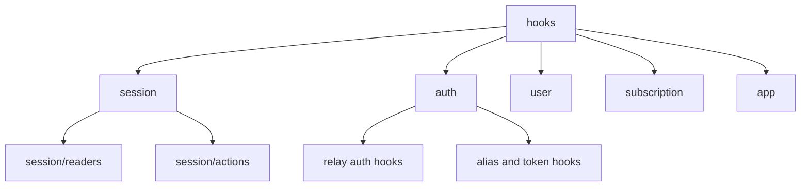

# Hooks Layer

## 목적

`hooks`는 `web-core` 외부 소비자가 세션과 도메인 기능을 읽고 요청하는 유일한 React 진입점입니다.

이 문서의 기본 원칙은 다음과 같습니다.

- 외부에서 읽을 수 있는 것은 `hook`과 `sessionContext`뿐입니다
- 외부에서 `...Core`, `transport`, 내부 store, service를 직접 읽으면 안 됩니다
- hook은 도메인별 폴더로 분류하고, 각 폴더 하위에 기능 단위 hook을 둡니다

## 현재 문제

현재 구조는 아래 문제가 있습니다.

- `hooks/index.ts`가 여전히 넓은 surface를 re-export 합니다
- 일부 hook은 호환성 alias 성격이라 이름과 실제 책임이 완전히 일치하지 않습니다
- `session/index.ts`는 실제 파일 구조와 stale export가 섞일 여지가 있어 지속적인 점검이 필요합니다

## 설계 원칙

### 1. 외부 읽기 진입점은 hook + sessionContext만 허용

허용:

- `useGlobalSession()`
- `useSessionAuth()`
- `useSessionIdentity()`
- `useSessionSelection()`
- 각 도메인 hook
- `getGlobalSessionContext()` 및 하위 session context getter

비허용:

- `cloudCore`, `relayCore`, `identityCore` 직접 접근
- `transport` 직접 접근
- `session/services` 직접 접근
- 내부 store나 signal 직접 접근

### 2. Hook은 도메인별 폴더 아래에 둔다

권장 구조:

```text
hooks/
  index.ts
  session/
    index.ts
    readers/
      useGlobalSession.ts
      useSessionAuth.ts
      useSessionIdentity.ts
      useSessionSelection.ts
    actions/
      useLogoutCloudSession.ts
      useRefreshCloudSiteSession.ts
      useRefreshRelaySession.ts
      useSessionLogout.ts
      useSwitchCloudSession.ts
      useInviteFlow.ts              # 초대 전체 시나리오 전용 훅
  auth/
    index.ts
    useFindAlias.ts
    useLogin.ts
    useLoginRelayGuestByDevice.ts
    useLoginRelaySocial.ts
    useLoginWithInviteCode.ts
    useRegisterUser.ts
    useRegisterUserV2.ts
    useVerifyAlias.ts
  user/
    index.ts
    useClouds.ts
    useCloudSessionCatalog.ts       # session/readers에서 이동
    useProfile.ts
    useRegisterDeviceToken.ts
    useUpdateCloud.ts
    useUpdateProfile.ts
    useUsers.ts
    useVerifyEmail.ts
    useVerifyNativeAppToken.ts
  subscription/
    index.ts
  app/
    index.ts
    useInitWebCore.ts
    useTokenRefresh.ts
    useServiceUnavailable.ts
    useDynamicDeviceId.ts
    useRelaySessionKeepAlive.ts   # 중계 세션 항시 유지
```

원칙:

- 폴더는 도메인
- 파일은 기능 단위 hook
- `index.ts`는 해당 도메인에서 공개할 hook만 export

### 3. Hook은 읽기와 요청 연결만 담당

hook의 책임:

- React state/subscribe 연결
- session service 호출용 adapter
- query/mutation 구성
- UI 친화적인 조합 반환

hook의 비책임:

- 세션 상태 직접 변경
- `...Core` 직접 변경
- transport 직접 호출
- 도메인 규칙 계산

## 권장 공개 Surface

### session domain

유지 권장:

- `useGlobalSession()`
- `useSessionAuth()`
- `useSessionIdentity()`
- `useSessionSelection()`
- `useSessionLogout()`
- `useRefreshRelaySession()`
- `useLogoutCloudSession()`
- `useRefreshCloudSiteSession()`
- `useSwitchCloudSession()`
- `useInviteFlow()` — 초대 진입(딥링크)부터 cloud 전환까지 한 시나리오로 구동하는 전용 훅. 내부에서 `useLoginWithInviteCode` + `switchCloudSession`을 조합 (orchestration.md §7)

정리 결정 (완료):

- `useLogoutRelaySession.ts`는 `useSessionLogout.ts`와 동일하게 `logoutRelaySession`을 래핑하므로 **제거하고 `useSessionLogout`으로 일원화**했습니다 (⑤ 공개면 = `useSessionLogout`).
- `useCloudSessionCatalog.ts`는 세션 reader가 아니라 cloud 목록 조회이므로 **`user` 도메인으로 이동**했습니다 (제거 아님).
- session facade hook(`useCloudSession`, `useAutoSelectCloud`, `useDelegatorId`, `useDynamicProfile`)은 현재 구조에서 제거/이동되었으므로 기본 공개면으로 다루지 않습니다.

### auth domain

유지 권장:

- relay/cloud 인증 관련 mutation hook
- alias 검증 관련 mutation hook

정리 결정 (확정):

- `useIssueToken`은 `api/login`을 **직접 호출**해 "hook → service만" 규칙(public-surface.md)을 어깁니다. 세션 경유 `useLogin`(`loginRelayUser`)으로 **수렴**하고, `issuingLoginId` UI 편의값은 `useLogin` 위에 재구성합니다.
- `useRefreshCloudToken`은 `api/refreshCloudToken`을 **직접 호출**해 `refreshCloudSession`의 서비스 레벨 single-flight를 **우회**합니다. 그대로 두면 사이트 전환 ↔ 병렬 리프레시 충돌 해결이 무력화되므로, **`refreshCloudSession` 경유로 수렴**합니다 (소켓 delegate도 이 경로 사용).
- `useIssueCloudToken`은 `delegate-cloud` + `exchange-token`을 **api 직접 조합**해 ③ 클라우드 전환과 중복이며, cloudCore 저장·activeServer 재계산을 빠뜨립니다. "selected cloud 변경은 `switchCloudSession`의 성공 결과로만 반영"(session-scenarios §7) 불변식을 지키려면 **제거하고 `useSwitchCloudSession`으로 수렴**합니다.

권장 방향 (수렴 후 유지):

- `useLoginRelayGuestByDevice`
- `useLoginRelaySocial`
- `useLoginWithInviteCode` (단독으로는 raw mutation, 시나리오는 `useInviteFlow`가 구동)
- `useLogin`
- `useVerifyAlias`

### user domain

유지 권장:

- user/cloud 조회 및 수정 관련 query/mutation hook
- push/device token 등록 hook

### subscription domain

유지 권장:

- `subscription/index.ts`를 통해 공개되는 subscription query/mutation hook

### app domain

- `useServiceUnavailable`
- `useInitWebCore`
- `useTokenRefresh`
- `useDynamicDeviceId`
- `useRelaySessionKeepAlive` (예정)

`app` 도메인은 외부 소비자가 직접 부르는 hook이라기보다, 앱 부트스트랩 시점에 한 번 마운트되어 **lifecycle/loop 정책을 구동하는 orchestration hook**들이 모이는 곳입니다. 세부 동작 규칙은 [orchestration.md](./orchestration.md)에 있습니다.

현재 판단:

- `useInitWebCore`는 app bootstrap lifecycle에 속하므로 현재 위치가 맞습니다
- `useTokenRefresh`도 interval/visibility/runtime lifecycle 때문에 `app` 위치가 맞습니다
- `useTokenRefresh`는 relay refresh 1분 주기를 이미 보유하며, **cloud 연결 시 cloudToken 기반 `refreshCloudSession`을 병렬 수행**하는 책임으로 확장합니다 (병렬 리프레시). cloud 실패는 logout으로 이어지지 않고 다음 주기/소켓 재인증에 위임합니다.
- `useDynamicDeviceId`는 native 주입 또는 persisted 상태에서 deviceId를 해석하는 lifecycle hook입니다. **디바이스 등록은 최초 앱 실행 시 수행되며, 등록 결과 deviceId는 `identityCore`에 저장**됩니다(`persistDeviceId` 서비스 경유).
- `useRelaySessionKeepAlive`(예정)는 relay 세션 부재를 감지하면 백그라운드로 `loginRelayGuestByDevice`를 수행해 **중계서버 로그인 상태를 항시 유지**합니다.
- 다만 위 hook 내부의 세션 복구/전이 규칙 자체는 계속 `session/services` 쪽에 있어야 하며, hook은 lifecycle 트리거와 service 호출 연결만 담당합니다

## 제거 또는 축소 후보

### 1. 루트 level hook 파일 남용

현재 방향:

- 루트에는 `index.ts`만 둡니다
- 실제 hook 파일은 `app`, `auth`, `session`, `subscription`, `user` 아래로 이동합니다
- `session`은 다시 `readers`, `actions`로 세분화합니다

판단:

- 이 구조는 현재 코드에 반영되었습니다
- 남은 정리 대상은 `session/index.ts`의 export 정제와 일부 파일의 도메인 재배치입니다

### 2. session/index.ts에서 hook 재-export

현재 `session/index.ts`는 session public API를 제공하는 계층이고, hook은 `hooks/session/index.ts`를 통해 따로 공개하는 방향이 맞습니다.

문서 규칙:

- `src/session/index.ts`는 session context/service/type만 공개합니다
- `src/hooks/session/index.ts`는 React hook만 공개합니다
- 두 surface를 서로 다시 re-export 하지 않습니다

### 3. 내부 setter 노출

아래 계열은 외부 공개 surface에서 줄여야 합니다.

- `setSessionAuthenticated`
- `setSessionIdentityState`
- `setSessionProfile`
- `clearSessionProfile`

이 값들은 hook이나 외부 feature가 직접 다루는 것이 아니라 service 내부에서만 사용되는 방향이 맞습니다.

### 4. 중복·경계위반 hook 수렴 (완료)

새 시나리오 구조에서 중복되거나 "hook → service만" 규칙을 어기던 hook들. 앱 레이어는 전부 새 surface로 재작성되므로 여기서는 **라이브러리 내부**만 다룹니다. 아래는 하드 제거/이동 완료 상태입니다 (앱은 새 surface로 별도 마이그레이션).

| 후보                                        | 처리                                                    | 대체                                                      |
| ------------------------------------------- | ------------------------------------------------------- | --------------------------------------------------------- |
| `session/actions/useLogoutRelaySession.ts`  | ✅ 제거                                                 | `useSessionLogout`                                        |
| `auth/useIssueToken.ts`                     | ✅ 제거 (api 직접호출)                                  | `useLogin` (`issuingLoginId`는 `variables?.uid`로 재구성) |
| `auth/useRefreshCloudToken.ts`              | ✅ 제거 (single-flight 우회)                            | `refreshCloudSession` 경유 (소켓 delegate 포함)           |
| `auth/useIssueCloudToken.ts`                | ✅ 제거 (delegate+exchange 수동 조합, 전이 중복·불완전) | `useSwitchCloudSession` (`switchCloudSession`)            |
| `session/readers/useCloudSessionCatalog.ts` | ✅ `user` 도메인으로 이동 (제거 아님)                   | `hooks/user/useCloudSessionCatalog.ts`                    |

> app-runtime 쪽 `useRuntimeBinding`(app 레이어로 이동), connection 계층의 `useCloudSession`/`useCloudTokenRefresh`(제거)는 app-runtime docs 소관입니다.

## 권장 도메인 분류안



## 검토 포인트

- `session/readers/useCloudSessionCatalog.ts`를 `user` 도메인으로 옮길지
- `useLogoutRelaySession.ts`와 `useSessionLogout.ts`를 하나로 수렴할지
- `useTokenRefresh`의 세션 복구 규칙을 얼마나 service로 내릴지
