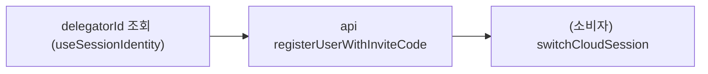

# Hooks Orchestration

## 목적

`hooks/app` 도메인의 lifecycle/loop hook이 구동하는 **동작 정책(orchestration policy)** 을 정의합니다.

여기서 다루는 것은 "어떤 전이를 하는가"(그건 [session/session-scenarios.md](../session/session-scenarios.md)의 service 책임)가 아니라, **언제·얼마나 자주·어떤 순서로 그 전이를 트리거하고, 실패 시 어떻게 폴백하는가**입니다.

원칙:

- hook은 lifecycle 트리거 + service 호출 연결만 담당합니다
- 상태 전이 자체는 `session/services`가 소유합니다
- 경계를 넘는 효과(소켓 재인증, 캐시 클리어)는 web-core가 수행하지 않고 socket delegate / 외부 레이어가 가져갑니다

## 1. 중계서버 로그인 항시 유지 (`useRelaySessionKeepAlive(enabled)`)

목표: 명시적 logout이 없는 한 relay 세션이 항상 존재하도록 유지합니다.

규칙:

- `enabled: boolean` 인자로 게이트합니다(Host가 init 게이트 뒤에서 `true`로 마운트).
- 기본 진입은 게스트 로그인입니다. 소셜 로그인 시 토큰이 소셜 기준으로 교체됩니다(`loginRelaySocial`, 별도 승격 경로).
- `enabled && !isAuthenticated && deviceId` 조건에서 **백그라운드로 `loginRelayGuestByDevice(deviceId)`** 를 1회 수행합니다(`runningRef`로 재진입 차단).
- 최초 앱 실행 시 relay 게스트 로그인이 `delegatorId`를 저장합니다(이후 초대 로직에서 사용).

감지 신호: `useSessionAuth().isAuthenticated`(false) + 해석된 `deviceId` + `enabled` 게이트. 이 hook은 부재한 세션을 **복구**할 뿐 명시적 logout으로 세션을 내리지 않습니다.

> **HTTP 주기 리프레시 루프는 web-core에서 제거되었습니다.** 소켓 인증 수명주기(토큰 refresh 포함)는 SDK `AuthController`가 소유합니다 — app-runtime `docs/socket/auth/README.md` 참조. `session/services.refreshActiveCloudSession`은 서비스로 남아 있으나 현재 in-package 구동 훅이 없습니다.

## 6. 사이트 전환 ↔ 리프레시 single-flight

문제: 사이트 전환의 `target = uid@sid` refresh와 소켓 재인증 복구가 동시에 실행되면 token·selectedSiteId 경합이 발생합니다. **relay·cloud 양쪽 모두** 해당합니다 (중계서버도 site 전환 가능).

해결 (확정):

- **`refreshRelaySession`·`refreshCloudSession` 둘 다 서비스 레벨에 single-flight** 를 둡니다 (대칭). 각 축의 모든 진입(사이트 전환·소켓 재인증 복구)이 같은 in-flight promise를 공유합니다
- in-flight refresh가 있으면 새 호출은 그 promise에 합류(coalesce)합니다
- 단 **target이 다르면**(주기=target 없음 vs 사이트 전환=`uid@sid`) site-switch target을 우선해 직렬 실행합니다
- 서비스 레벨에 두는 이유: refresh 서비스가 selectedSiteId 저장 + token 교체의 유일 소유자이기 때문입니다. hook 레벨 가드는 호출자마다 중복·우회됩니다

## 7. 초대 (`useInviteFlow`)

목표: 딥링크 초대 코드로 **인증**을 구동합니다. cloud/site 진입은 이 hook이 하지 않고 소비자에게 맡깁니다.

흐름:

1. `useSessionIdentity()`에서 `delegatorId`를 읽는다 (게스트 로그인 시 저장된 값, `identityCore`)
2. **api `registerUserWithInviteCode(code, delegatorId, backend)`를 직접 호출**한다 (별도 `useLoginWithInviteCode` hook 없음)
3. cloud 진입이 필요하면 소비자가 ③클라우드 전환(`switchCloudSession`)을 이어서 수행한다

비고:

- `useInviteFlow`는 **인증만** 수행하며 cloud/site 진입을 자동으로 이어가지 않습니다. 인증 함수는 service가 아니라 `api/auth.ts`의 `registerUserWithInviteCode`입니다.
- 전이 sequence 상세는 [session-scenarios.md 시나리오 5](../session/session-scenarios.md)를 참조합니다.
- 과거의 `restorePreviousCloudSession`(캐시된 invited 번들 replay) 경로는 **제거**되었습니다. 번들 writer가 없어 죽은 경로였고, 초대 cloud 진입도 `switchCloudSession`(delegate-cloud → exchange-token)으로 일원화했습니다. 초대 cloud가 broker-delegable하지 않은 케이스가 확인되면 별도 재설계가 필요합니다(아래 TODO).

## 11. 디바이스 등록 (`useDynamicDeviceId`)

목표: device 기반 인증 흐름의 선행 조건인 deviceId를 확보·저장합니다.

규칙:

- 최초 앱 실행 시 디바이스 등록 훅을 수행합니다
- deviceId는 native 주입(`window.CHATIC_APP_DEVICE_ID`) 또는 persisted 상태에서 해석합니다
- 등록을 수행하면 **deviceId를 `identityCore`에 저장**합니다 (`persistDeviceId` 서비스가 localStorage와 identityCore에 함께 반영)
- `loginRelayGuestByDevice` / `loginRelaySocial`이 이 deviceId를 재사용합니다

## 선반영(optimistic)과 경계

설계 의도: ③클라우드 전환·⑥사이트 전환은 cid/sid를 **선반영**합니다. web-core hook은 `session/services`를 통해 세션 상태(cid/sid)만 바꾸고, 그 변경을 **app-runtime의 binding/DataProvider가 구독**해 캐싱 데이터를 우선 표시하고 소켓을 재연결합니다. 즉 "캐싱 데이터 표시"는 web-core가 아니라 app-runtime/data 소관입니다.

> **현황:** cid/sid **선반영 + 실패 롤백**은 대부분 **구현 완료**다 — `switchCloudSession`(cid 선반영+롤백), `switchSiteSession`(sid 선반영+롤백), 둘 다 `session/services.ts`. **잔존 TODO는 relay 사이트 전환 하나뿐**: `refreshRelaySession(target=uid@sid)`가 sid를 refresh 성공 후에만 반영(선반영 아님).

## 미구현 TODO

- **relay 사이트 전환 sid 선반영 (⑥ relay 경로):** `refreshRelaySession(target=uid@sid)`가 아직 sid를 refresh **성공 후에만** 반영한다. refresh 전 선반영 + 실패 롤백 필요. (`switchSiteSession`의 cloud 경로·`switchCloudSession`의 cid는 이미 구현됨.)
- **초대 cloud 비-delegable 케이스:** `switchCloudSession`의 `delegate-cloud`가 초대 cloud에서 404가 나는 경우의 재진입 경로. (과거 `restorePreviousCloudSession`이 담당했으나 writer 부재로 제거됨 — 필요하면 번들 writer까지 포함해 재설계.)

## 검증

각 동작 정책의 검증 기준.

자동 (web-core 단위 테스트):

- **① 항시 로그인** — 미인증 + deviceId 준비 시 `loginRelayGuestByDevice`가 1회 호출되고, 진행 중 재진입이 차단된다. 인증 상태면 호출되지 않는다.
- **⑥ single-flight** — `refreshRelaySession`·`refreshCloudSession` 동일 key 동시호출이 1회로 coalesce되고, 다른 key는 직렬 실행되어 selectedSiteId/token 경합이 없다.
- **⑥ 사이트 전환** — `target = uid@sid` refresh가 selectedSiteId를 refresh 결과로만 반영한다 (독립 setter 아님).
- **⑦ 초대** — delegatorId 부재 시 throw, 존재 시 `registerUserWithInviteCode`(`useInviteFlow`) → `switchCloudSession` 순서로 진행한다.
- **⑪ 디바이스 등록** — `persistDeviceId`가 `identityCore.setDeviceId`와 localStorage에 함께 반영하고, 로그아웃 후에도 deviceId가 유지된다.

수동/통합 (web-core 경계 밖, app-runtime 결합 후):

- **③⑥ cid/sid 반응** — 전환 시 캐시 우선 표시 + 소켓 재연결 (app-runtime/data·binding).
- **⑤ 로그아웃 캐시 클리어** — 로그아웃 후 다른 유저 로그인 시 데이터가 꼬이지 않음 (외부 레이어).
- **⑧⑨ 소켓 인증** — SDK `AuthController`(app-runtime) 소유. web-core 브리지 헬퍼(seed/sign/writeback)가 올바른 kind로 라우팅되는지는 app-runtime 결합 후 확인.
- **선반영+롤백** — `switchCloudSession`(cid)·`switchSiteSession`(sid)의 "전환 실패 → 이전 cid/sid 복귀"는 `services.test.ts`에 구현됨. relay 사이트 전환(refreshRelaySession) sid 선반영만 TODO.

## 관련 문서

- [README.md](./README.md) — hook 분류·폴더 구조
- [public-surface.md](./public-surface.md) — 로직 ↔ hook 매핑
- [../session/session-scenarios.md](../session/session-scenarios.md) — 전이 service 시나리오
