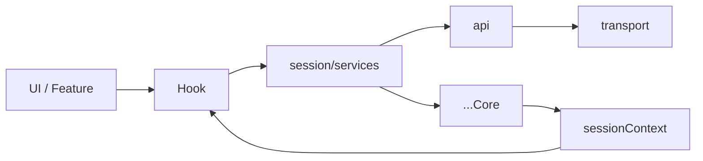

# Hooks Public Surface

## 원칙

외부에서 읽을 수 있는 공개 surface는 아래 둘뿐입니다.

1. hook
2. session context getter

즉, 외부 feature/UI는 아래 방식으로만 접근해야 합니다.

- React 환경: hook 사용
- non-React 환경: session context getter 사용

## 허용되는 읽기 API

### Hook

- `useGlobalSession()`
- `useSessionAuth()`
- `useSessionIdentity()`
- `useSessionSelection()`
- `useCloudSessionCatalog()`
- `useRefreshRelaySession()`
- `useLogoutCloudSession()`
- `useRefreshCloudSiteSession()`
- `useRestoreInvitedCloudSession()`
- `useSwitchCloudSession()`
- 도메인별 query/mutation hook

### Session Context

- `getGlobalSessionContext()`
- `getRelaySessionContext()`
- `getCloudSessionContext()`
- `getIdentityContext()`
- `getActiveServerContext()`

## 허용되지 않는 읽기 API

- `cloudCore.*`
- `relayCore.*`
- `identityCore.*`
- `transport.*`
- 내부 signal/store
- 내부 selection helper

## 요청 흐름

핵심 규칙:

- hook은 요청을 service로 전달합니다
- hook은 결과 상태를 session context 구독으로 읽습니다
- hook이 `transport`나 `...Core`를 직접 다루면 안 됩니다
- session reader hook은 `session context getter`만 사용합니다
- session action hook은 `session/services`만 사용합니다

## 권장 Export 정책

### `src/hooks/index.ts`

이 파일은 외부에 공개할 hook만 export 해야 합니다.

제거 또는 축소 대상:

- 내부 구현 편의용 hook 재-export
- service migration 중간 단계용 hook
- 단일 필드 selector만 제공하는 과도한 wrapper

### `src/index.ts`

최종 공개 surface는 여기서 다시 좁혀야 합니다.

권장 방향:

- `export * from './hooks'`는 유지 가능
- 단, `hooks/index.ts`가 충분히 정제된 상태여야 함
- `session/index.ts`에서 hook을 다시 export 하는 구조는 제거 권장

## 검토 포인트

- 외부 소비자가 정말 필요한 hook만 남겼는지
- hook 이름이 session service naming과 일치하는지
- hook이 읽기 API인지, 요청 API인지 역할이 명확한지
