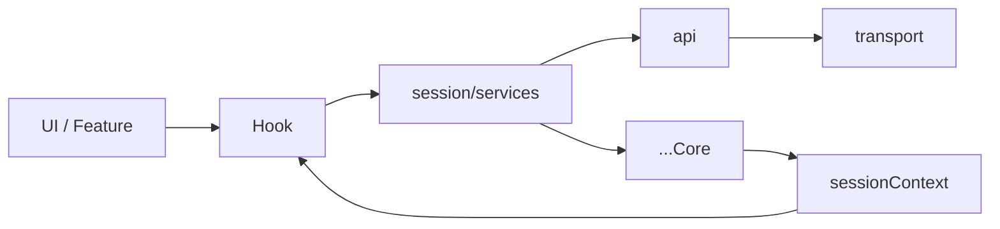

# Hooks Public Surface

## 원칙

외부에서 읽을 수 있는 공개 surface는 아래 둘뿐입니다.

1. hook
2. session context getter

즉, 외부 feature/UI는 아래 방식으로만 접근해야 합니다.

- React 환경: hook 사용
- non-React 환경: session context getter 사용

## 허용되는 읽기 API

### Hook

- `useGlobalSession()`
- `useSessionAuth()`
- `useSessionIdentity()`
- `useSessionSelection()`
- `useCloudSessionCatalog()`
- `useRefreshRelaySession()`
- `useLogoutCloudSession()`
- `useRefreshCloudSiteSession()`
- `useSwitchCloudSession()`
- `useInviteFlow()`
- 도메인별 query/mutation hook

### Session Context

- `getGlobalSessionContext()`
- `getRelaySessionContext()`
- `getCloudSessionContext()`
- `getIdentityContext()`
- `getActiveServerContext()`

## 허용되지 않는 읽기 API

- `cloudCore.*`
- `relayCore.*`
- `identityCore.*`
- `transport.*`
- 내부 signal/store
- 내부 selection helper

## 소비자 로직 ↔ hook 매핑

외부 feature/UI가 수행하려는 동작과, 그때 사용해야 하는 공개 hook의 대응입니다. "직접 core/service를 조합"하지 말고 아래 hook을 통합니다. 각 hook이 내부적으로 수행하는 전이 상세는 [session/session-scenarios.md](../session/session-scenarios.md)를 참조합니다.

| #   | 하려는 동작                   | 사용 hook                                                 | 비고                                                                                      |
| --- | ----------------------------- | --------------------------------------------------------- | ----------------------------------------------------------------------------------------- |
| ①   | 중계서버 로그인 항시 유지     | `useRelaySessionKeepAlive` (app)                          | relay 부재 감지 → 백그라운드 게스트 로그인                                                |
| ②   | 병렬 리프레시 (relay + cloud) | `useTokenRefresh` (app)                                   | 1분 주기, cloud는 cloudToken 기반                                                         |
| ③   | 클라우드 전환                 | `useSwitchCloudSession`                                   | cid 변경 → app-runtime이 데이터/소켓 반응 (선반영+롤백은 TODO, orchestration.md)          |
| ④   | 클라우드 로그아웃             | `useLogoutCloudSession`                                   | relay fallback 복귀                                                                       |
| ⑤   | 중계서버 로그아웃             | `useSessionLogout`                                        | **캐시 클리어는 외부 레이어 책임 (이 hook은 캐시를 비우지 않음)**                         |
| ⑥   | 사이트 전환                   | `useRefreshCloudSiteSession` / `useRefreshRelaySession`   | `target = uid@sid`, 서비스 single-flight로 ②와 직렬화                                     |
| ⑥′  | 현재 세션 리프레시            | `useRefreshCurrentCloudSession`                           | 사이트 전환 없이 현재 siteId 그대로 cloud token 재발급                                    |
| ⑦   | 초대                          | `useInviteFlow` (전용 훅)                                 | 초대 전체 시나리오를 한 훅으로 구동 (내부에서 `useLoginWithInviteCode` + cloud 전환 조합) |
| ⑧   | 소켓 리프레시                 | (소켓 모듈 연계) `useRefreshCloudToken` 등 토큰 공급 hook | app-runtime/socket delegate가 호출, web-core는 토큰만 공급                                |
| ⑨   | 소켓 401 복구                 | (소켓 모듈 연계) cloud refresh hook                       | delegate가 refresh 후 `auth:update` 재시도                                                |
| ⑪   | 디바이스 등록                 | `useRegisterDeviceToken` (app)                            | 최초 1회 등록 후 재실행 불필요, 성공 시 deviceToken을 identityCore에 저장                 |

규칙:

- ⑧⑨의 hook은 외부 feature가 직접 부르는 surface가 아니라 **소켓 모듈(delegate)이 호출할 연계 진입점**입니다 (public-api.md "소켓 모듈 연계" 참조).
- ⑤ logout hook은 세션 전이만 수행하고 **app-runtime/data·react-query 캐시를 비우지 않습니다**. 캐시 클리어는 외부 레이어가 logout 완료 후 수행합니다.

## 요청 흐름

핵심 규칙:

- hook은 요청을 service로 전달합니다
- hook은 결과 상태를 session context 구독으로 읽습니다
- hook이 `transport`나 `...Core`를 직접 다루면 안 됩니다
- session reader hook은 `session context getter`만 사용합니다
- session action hook은 `session/services`만 사용합니다

### api 직접 호출 경계 (과잉 제거 방지)

"hook은 service만"은 **세션 *전이*에 한정**됩니다. api를 직접 호출하는 것 자체가 위반은 아닙니다.

- **위반 (서비스 경유 필수):** 로그인·토큰 발급/갱신·클라우드 전환처럼 **세션 상태를 바꾸는 전이**. 이 hook이 `api`를 직접 부르면 세션 hydrate·저장·activeServer 재계산을 빠뜨려 일관성이 깨집니다. → `session/services` 경유. (예: `useIssueToken`/`useRefreshCloudToken`/`useIssueCloudToken`는 위반이라 각각 `useLogin`/`refreshCloudSession`/`useSwitchCloudSession`으로 수렴)
- **허용 (api 직접 호출 정상):** 세션을 건드리지 않는 **순수 조회·검증·등록**. → `api` 직접 호출 OK. (예: `useFindAlias`, `useVerifyAlias`, `useRegisterUser`)

판단 기준: "이 hook이 실패했을 때 세션 상태(인증/cloud/site/profile)가 바뀌어야 하는가?" 그렇다면 서비스 경유, 아니면 api 직접 허용.

## 권장 Export 정책

### `src/hooks/index.ts`

이 파일은 외부에 공개할 hook만 export 해야 합니다.

제거 또는 축소 대상:

- 내부 구현 편의용 hook 재-export
- service migration 중간 단계용 hook
- 단일 필드 selector만 제공하는 과도한 wrapper

### `src/index.ts`

최종 공개 surface는 여기서 다시 좁혀야 합니다.

권장 방향:

- `export * from './hooks'`는 유지 가능
- 단, `hooks/index.ts`가 충분히 정제된 상태여야 함
- `session/index.ts`에서 hook을 다시 export 하는 구조는 제거 권장

## 검토 포인트

- 외부 소비자가 정말 필요한 hook만 남겼는지
- hook 이름이 session service naming과 일치하는지
- hook이 읽기 API인지, 요청 API인지 역할이 명확한지
