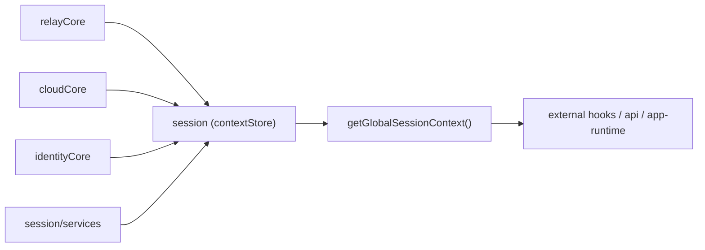

# Session Layer

## 목적

`session`은 `web-core`의 전역 세션 read model 계층입니다. raw 값을 직접 소유하지 않고, 여러 상태 저장소(core)를 조합해 애플리케이션이 쓸 안정적인 도메인 세션 뷰를 제공합니다.

주요 구현 기준:

- `libs/web-core/src/session/contexts.ts` — 공개 getter 파사드
- `libs/web-core/src/session/contextStore.ts` — 전역 스냅샷 assembler + 상태 저장/전이
- `libs/web-core/src/session/utils.ts` — 구독/캐시 무효화 신호
- `libs/web-core/src/session/services.ts` — 상태 전이 orchestration
- `libs/web-core/src/session/core/cloudCore.ts` · `relayCore.ts` · `identityCore.ts` — raw 저장 core

## 책임

- 외부 호출자에게 단일 전역 세션 스냅샷(`getGlobalSessionContext`) 제공
- relay 상태, cloud 상태, identity, active server 계산 결과 조합
- cloud 전환, site 토큰 갱신, logout 흐름 orchestration(services)
- 외부 모듈로부터 core 세부 구현 은닉

## 비책임

- 소켓 인증 프로토콜 실행 — SDK `AuthController`(app-runtime)
- transport 요청 실행 — transport 계층
- relay endpoint raw source 소유 — transport
- cloud storage raw source 소유 — cloudCore

session은 cloud token·endpoint를 **공급**하지만, 소켓 인증 재시도·실패 감지는 app-runtime/SDK 경계에 둡니다.

> **프로필은 더 이상 session이 저장하지 않습니다.** raw 토큰만 인증용으로 보관하고, profile fact(userRole/isGuest/userType/permissions/name/photo)는 app 레이어(`useProfileFacts`, `@chatic/app-runtime`)가 캐시된 프로필에서 추적합니다. session은 active 토큰의 user 필드를 동기 seed(`getActiveSessionUser`)로만 노출합니다. 과거의 `sessionIdentity.ts`(파생 permissions 계산)는 제거됐고, 그 파생은 app 레이어로 이동했습니다.

## 설계 원칙

외부 모듈은 `getGlobalSessionContext()`(또는 `useGlobalSession()`)를 기본 진입점으로 씁니다. `getCloudSessionContext()`·`getActiveServerContext()` 같은 하위 getter는 보조 API입니다. 목적은 소비자가 `cloudCore`/`relayCore`/`identityCore`를 직접 조합하지 않게 하는 것입니다.

## 핵심 개념

### 1. Relay Session

기준(fallback) 세션입니다.

- relay `backend`/`wss`는 transport endpoint 헬퍼(`getDynamicRelayBackend/Wss`)에서 결정됩니다 — relayCore가 저장하지 않고 위임합니다.
- **relay 인증 진리 = relay 토큰의 존재**(`isAuthenticated = !!relayCore.getRelayToken()`). 프로필이 아닙니다.
- 명시적 logout·token expiry·복구 불가 인증 실패가 없으면 relay 연속성을 유지하는 것을 목표로 합니다.

### 2. Cloud Session

전환 가능한 세션입니다.

- 각 cloud는 자체 `backend`/`wss`를 가집니다(delegation token에서 유도).
- cloud 활성화는 delegation token + 교환된 cloud token에 의존합니다.
- cloud별 site session은 독립 발급·갱신됩니다.

### 3. Active Server

request·socket 소비자가 실제로 붙는 실행 대상입니다. cloud가 active이면 cloud, 아니면 relay. `contextStore.ts`의 `resolveActiveServerContext()`가 계산합니다.

## 경계 다이어그램

## Source of Truth

- relay 런타임 상태·relay 토큰: `relayCore`
- cloud 런타임 상태·토큰: `cloudCore`
- identity raw 상태(`delegatorId`/`deviceId`/`registeredDeviceToken`): `identityCore`
- active target 계산: `contextStore`
- profile fact 파생: **app 레이어**(`useProfileFacts`, session 밖)

## 스펙 규칙

- `web-core` 내부 인프라가 아니면 `cloudCore`/`relayCore`/`identityCore`를 직접 읽지 않습니다.
- 소비자는 `getGlobalSessionContext()`/`useGlobalSession()`을 우선 씁니다.
- cross-context 상태 전이는 반드시 `session/services`를 통해 수행합니다.
- cloud switching은 relay 기준 세션을 끊지 않고 수행합니다.

## 관련 문서

- [context-model.md](./context-model.md)
- [session-scenarios.md](./session-scenarios.md)
- [public-api.md](./public-api.md)
