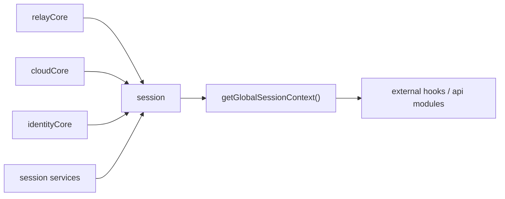

# Session Layer

## 목적

`session`은 `web-core`의 전역 세션 read model 계층입니다.

이 계층은 모든 raw 값을 직접 소유하지 않습니다. 대신 여러 상태 저장소를 조합해서, 애플리케이션이 사용할 수 있는 안정적인 도메인 관점의 세션 뷰를 제공합니다.

주요 구현 기준:

- `libs/web-core/src/session/contexts.ts`
- `libs/web-core/src/session/contextStore.ts`
- `libs/web-core/src/session/sessionIdentity.ts`
- `libs/web-core/src/session/services.ts`
- `libs/web-core/src/core/cloudCore.ts`
- `libs/web-core/src/core/relayCore.ts`
- `libs/web-core/src/core/identityCore.ts`

## 책임

- 외부 호출자에게 단일 전역 세션 스냅샷 제공
- relay 상태, cloud 상태, profile 상태, active server 계산 결과를 조합
- cloud 전환, cloud 복원, site 토큰 갱신, logout 흐름을 orchestration
- 외부 모듈로부터 `core` 세부 구현을 숨김
- hook 및 getter 형태의 안정적인 소비 API 제공

## 비책임

- 소켓 인증 프로토콜 자체 실행
- transport 요청 자체 실행
- relay endpoint raw source 소유
- cloud storage raw source 소유

추가로, 웹소켓 인증 실패 복구의 1차 제어도 소켓 모듈이 담당합니다. `session`은 cloud token 및 endpoint를 공급하지만, 실제 socket auth 재시도와 실패 감지는 socket 모듈 경계에 둡니다.

이 책임들은 `transport`, `core`, 혹은 소켓 클라이언트 구현에 속합니다. `session`은 그들이 사용할 컨텍스트만 제공합니다.

## 설계 원칙

외부 모듈은 기본적으로 `getGlobalSessionContext()`를 기본 진입점으로 사용해야 합니다.

`getCloudSessionContext()`, `getActiveServerContext()` 같은 하위 getter는 남길 수 있지만, 이는 보조 API입니다. `session` 계층의 목적은 외부 소비자가 `cloudCore`, `relayCore`, `identityCore` 상태를 직접 조합하지 않도록 막는 데 있습니다.

## 핵심 개념

### 1. Relay Session

relay session은 기준 세션입니다.

- relay `http`, `wss` endpoint는 transport/runtime 설정으로부터 항상 결정됩니다
- relay session은 fallback 실행 대상입니다
- 명시적 logout, token expiry, 복구 불가능한 인증 실패가 없으면 relay 인증 연속성이 유지되는 것을 목표로 합니다

### 2. Cloud Session

cloud session은 전환 가능한 세션입니다.

- 각 cloud는 자체 `backend`, `wss`를 가집니다
- cloud는 런타임에 전환될 수 있습니다
- cloud 활성화는 delegated auth와 exchanged cloud token에 의존합니다
- cloud별 site session은 독립적으로 발급되고 갱신될 수 있습니다

### 3. Profile Context

relay와 cloud는 서로 다른 profile view를 가질 수 있습니다.

따라서 스펙에서는 profile을 아래를 담는 컨텍스트로 다룹니다.

- relay profile
- cloud profile
- 현재 active session 기준 profile

즉, profile은 병합된 단일 profile이 아니라, relay/cloud/active 관점으로 각각 접근 가능해야 합니다.

### 4. Active Server

active server는 request 및 socket 소비자가 실제로 붙어야 하는 실행 대상입니다.

- cloud가 active이면 active server는 cloud입니다
- 그렇지 않으면 relay입니다

이 규칙은 현재 `libs/web-core/src/session/contextStore.ts`의 `resolveActiveServerContext()`에 구현되어 있습니다.

## 경계 다이어그램

## Source of Truth

- relay 런타임 상태: `relayCore`
- cloud 런타임 상태: `cloudCore`
- identity raw 상태: `identityCore`
- 파생 identity 및 permissions 계산: `sessionIdentity`
- active target 계산: `session/contextStore`

## 스펙 규칙

- `web-core` 내부 인프라 코드가 아니면 `cloudCore`, `relayCore`를 직접 읽지 않아야 합니다
- `web-core` 내부 인프라 코드가 아니면 `identityCore`도 직접 읽지 않아야 합니다
- 소비자는 `getGlobalSessionContext()` 또는 `useGlobalSession()`를 우선 사용해야 합니다
- cross-context 상태 전이는 반드시 session service를 통해 수행해야 합니다
- cloud switching은 relay 기준 세션을 끊지 않고 수행되어야 합니다

## 관련 문서

- [context-model.md](./context-model.md)
- [session-scenarios.md](./session-scenarios.md)
- [public-api.md](./public-api.md)
