# Session Scenarios

## 목적

relay와 cloud 세션 처리의 의도된 lifecycle 시나리오를 정의합니다.

## 전제 조건

- relay `http`, `wss` endpoint는 runtime 설정으로부터 항상 얻을 수 있습니다
- relay `http` session은 기준 세션이며 logout, expiry, auth failure가 발생하지 않는 한 유지되는 것이 목표입니다
- cloud는 자체 `http`, `wss` endpoint를 가집니다
- cloud는 선택된 cloud session 데이터 집합을 교체하는 방식으로 런타임 전환될 수 있습니다
- relay와 cloud는 서로 다른 profile view를 가질 수 있습니다

## 서비스 접근 규칙

세션 관련 모든 변경 작업은 반드시 `session/services`를 통해서만 접근해야 합니다.

허용되는 변경 주체:

- `session/services`: 비즈니스 액션 단위의 세션 변경
- `...Core`: raw 저장과 get/set

허용되지 않는 접근:

- feature 코드가 `cloudCore`, `relayCore`를 직접 변경
- component/hook이 session 내부 setter를 직접 호출
- 여러 저장소를 feature 코드에서 수동으로 조합해 세션 상태 변경

즉, 외부는 "무엇을 하고 싶은가"를 service에 요청하고, service가 필요한 `core` 변경과 context 갱신을 수행해야 합니다.

## 필수 서비스 기능

시나리오를 충족하려면 최소한 아래 서비스 기능이 정의되어야 합니다.

## 현재 구현 상태

현재 `libs/web-core/src/session/services.ts` 기준 구현 상태는 다음과 같습니다.

- 구현됨
    - `initializeRelaySession`
    - `loginRelayGuestByDevice`
    - `loginRelayUser`
    - `loginRelaySocial`
    - `registerUserWithInviteCode` (raw API, `useInviteFlow`가 구동 — 문서 곳곳의 옛 이름 `loginWithInviteCode`는 이 심볼로 대체됨)
    - `refreshRelaySession`
    - `logoutRelaySession`
    - `switchCloudSession` (cloud 전환 + cid **선반영+롤백** + 병렬 리프레시 single-flight)
    - `refreshCloudSession` (cloudToken 기반, 서비스 single-flight)
    - `switchSiteSession` (sid **선반영+롤백**, 활성 서버별 refresh 커밋)
    - `refreshActiveCloudSession` (주기 루프용 cloud 갱신)
    - `logoutCloudSession`
    - `persistDeviceId` (deviceId를 identityCore에도 저장)
- 제거됨
    - `restorePreviousCloudSession` — invited 번들 writer 부재로 죽은 경로였고, 초대 cloud 진입을 `switchCloudSession`으로 일원화하며 제거
- 미구현 (TODO)
    - **relay 사이트 전환** cid/sid 선반영: `refreshRelaySession(target=uid@sid)`만 아직 성공 후 반영(선반영 아님). `switchCloudSession`(cid)·`switchSiteSession`(sid)은 **구현 완료** (orchestration.md "미구현 TODO" 참조)

구현 메모:

- relay 로그인 계열 서비스는 API 응답의 `UserTokenView`에서 relay profile을 갱신하고 session auth 상태를 반영합니다.
- invite 로그인은 `isInvited=true`를 session identity에 반영합니다.
- `persistDeviceId`는 현재 local storage에 raw device id를 저장하는 최소 구현입니다.
- `logoutCloudSession`은 relay 세션을 유지한 채 cloud delegation/token/profile만 정리합니다.
- `refreshRelaySession(target)`은 relay auth refresh 이후 relay selected site를 `uid@sid` 기준으로 갱신합니다.

### 1. `initializeRelaySession`

목적:

앱 시작 시 relay 기준 세션 초기화와 runtime 상태 설정을 담당합니다.

예상 책임:

- relay transport 초기화
- persisted session state 로드
- 초기 인증 여부 확인
- runtime의 `isInitialized`, `isAuthenticated`, `error` 갱신

### 2. `loginRelayGuestByDevice`

목적:

device 기반으로 relay guest 세션을 생성합니다.

예상 책임:

- `deviceId` 기반 임시 유저 등록 호출
- relay token 및 관련 정보 저장
- guest identity 반영
- 필요 시 `delegatorId` 보정

### 3. `loginRelaySocial`

목적:

device 기반 social 인증을 relay 세션에 반영합니다.

예상 책임:

- native token 검증 호출
- relay token 및 연관 정보 저장
- social user 기준 identity 갱신
- OAuth provider 반영

현재 구현 메모:

- `verify-native-token` 기반 relay social login을 서비스로 감쌉니다.
- provider가 전달되면 `IdentityCore.oAuthProvider`도 함께 갱신합니다.

### 4. `loginWithInviteCode`

목적:

초대 코드를 사용해 relay 기준 초대 로그인 세션을 생성합니다.

예상 책임:

- invite code와 `delegatorId`로 로그인 호출
- invite 로그인 결과 저장
- invited identity 반영
- 이후 cloud 진입 가능 상태 준비

현재 구현 메모:

- invite 로그인은 relay profile 저장과 함께 `isInvited=true`를 반영합니다.
- cloud 진입은 이후 `switchCloudSession()` 단계에서 이어집니다 (`useInviteFlow`가 구동).

### 5. `refreshRelaySession`

목적:

relay auth refresh를 수행하고 relay 인증 연속성을 유지합니다.

예상 책임:

- relay auth token refresh
- 필요 시 `target = uid@sid` 기반 site 전환 처리
- refresh 결과 저장
- 필요 시 relay profile 재동기화
- runtime auth 상태 유지

비고:

relay도 `target = uid@sid`를 포함한 refresh를 통해 site 전환이 가능합니다.

현재 구현 메모:

- 현재 서비스는 relay auth refresh와 relay profile 재동기화까지 구현되어 있습니다.
- `target = uid@sid`가 전달되면 relay selected site도 함께 갱신합니다.

### 6. `logoutRelaySession`

목적:

relay 기준 전체 세션 종료와 관련된 정리 작업을 담당합니다.

예상 책임:

- relay/cloud 관련 저장 상태 정리
- identity 및 runtime 상태 정리
- logout callback 실행
- 필요한 경우 OAuth logout 연동

현재 구현 메모:

- relay logout 시 cloud session/profile도 함께 정리됩니다.
- device id 저장값은 유지하고, device token 성격의 기존 로컬 키만 제거합니다.

### 7. `switchCloudSession`

목적:

relay 기준 상태를 유지하면서 target cloud로 활성 세션을 전환합니다.

예상 책임:

- delegate-cloud 호출
- exchange-token 호출
- cloud token/delegation token/selected cloud 저장
- 필요 시 site 상태 초기화
- identity와 active server 갱신

비고:

selected cloud 변경은 독립 setter가 아니라 이 서비스의 성공 결과로만 반영되어야 합니다.

### 8. `refreshCloudSession`

목적:

현재 cloud token을 갱신하고, 필요하면 특정 site 세션용 token까지 발급합니다.

예상 책임:

- refresh target 계산
- cloud token 갱신
- `target = uid@sid`인 경우 selected site 저장
- socket auth에 필요한 최신 token 공급
- socket 모듈이 인증 실패 후 재호출할 수 있는 refresh 진입점 제공

비고:

selected site 변경은 독립 setter가 아니라 `target = uid@sid`를 사용한 refresh 결과로만 반영되어야 합니다. 이 규칙은 relay와 cloud에 공통으로 적용됩니다.

single-flight 규칙:

- `refreshCloudSession`은 **서비스 레벨 single-flight**를 가져야 합니다. 주기 리프레시 루프(시나리오 13), 사이트 전환(`target = uid@sid`), 소켓 401 복구가 모두 같은 in-flight promise를 공유합니다.
- in-flight refresh가 있으면 새 호출은 그 promise에 합류(coalesce)합니다.
- 단 **target이 다르면**(주기=target 없음 vs 사이트 전환=`uid@sid`) site-switch target을 우선해 직렬 실행합니다.
- 이유: `refreshCloudSession`이 selectedSiteId 저장 + cloudToken 교체의 유일 소유자이므로, 직렬화를 서비스에 두어야 모든 진입이 같은 경합 보호를 공유합니다. hook 레벨 가드는 호출자마다 중복·우회됩니다.

### 9. `logoutCloudSession`

목적:

relay 세션은 유지한 채 현재 cloud 세션만 해제합니다.

예상 책임:

- cloud token/delegation token 정리
- selected cloud/site 정리
- relay fallback 복귀
- identity와 active server 재계산

현재 구현 메모:

- 현재 구현은 cloud delegation token, cloud token, cloud selected site, cloud profile을 정리합니다.
- selected cloud는 `default` fallback으로 복귀합니다.
- relay profile과 relay auth 상태는 유지됩니다.

### 10. `persistDeviceId`

목적:

device 기반 relay 로그인과 복구 흐름에 필요한 device identity를 저장합니다.

예상 책임:

- device id 생성 또는 수집
- device id 저장
- guest/social login 흐름에서 재사용 가능하도록 보존

현재 구현 메모:

- 현재 구현은 `localStorage`에 device id를 저장하는 최소 서비스입니다.
- `loginRelayGuestByDevice()`는 이 서비스를 내부에서 먼저 호출합니다.

## 시나리오 1: 클라우드 전환 (`switchCloudSession`)

목적:

기준 relay 세션을 끊지 않은 상태에서 실행 대상을 특정 cloud로 전환합니다.

흐름:

1. relay server의 `POST /users/0/delegate-cloud` 호출
2. target cloud id 전달
3. `delegateToken`, `backend`, `wss` 응답 수신
4. target cloud의 `POST /oauth/exchange-token` 호출
5. `delegateToken`과 target endpoint 정보 전달
6. `UserTokenView` 응답 수신
7. cloud delegation token, cloud token, selected cloud id 저장
8. 다른 cloud로 전환되는 경우 기존 cloud site selection 초기화
9. active server와 active profile 재계산

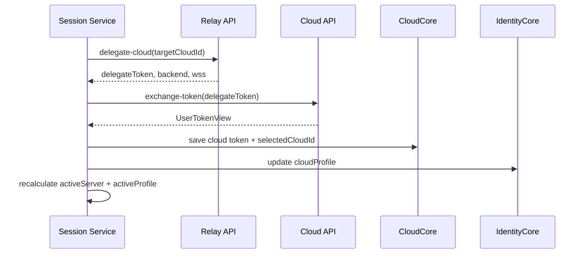

결과:

- relay session은 유지됩니다
- endpoint와 identity token이 완성되면 cloud session이 active 됩니다
- active server가 relay에서 cloud로 바뀔 수 있습니다

현재 구현 기준:

- `libs/web-core/src/session/services.ts`의 cloud switch 관련 서비스

## 시나리오 2: 클라우드 서버 리프레시 (`refreshCloudSession`)

목적:

현재 cloud token을 갱신하고, 필요하면 특정 site session용 token까지 발급합니다.

규칙:

- token refresh는 cloud token switch 과정에서 확보한 데이터를 재사용할 수 있습니다
- `target = uid@sid`이면 해당 site session 범위의 token을 발급합니다
- 갱신된 token은 이후 socket auth update에 사용할 수 있습니다

흐름:

1. 현재 cloud token 조회
2. site session이 필요하면 refresh target 구성
3. 새로운 `UserTokenView` 요청
4. selected site id 저장
5. cloud token 기반 profile 데이터 갱신
6. 최신 cloud snapshot 노출

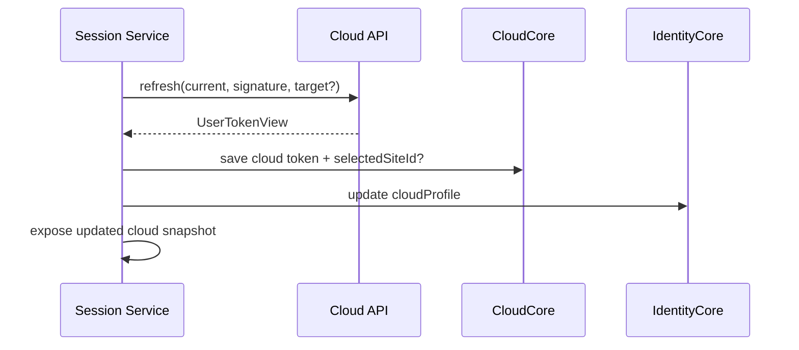

결과:

- cloud endpoint는 유지됩니다
- 전체 cloud switch 없이 token만 갱신됩니다
- cloud site session이 socket auth 준비 상태가 됩니다

현재 구현 기준:

- `libs/web-core/src/session/services.ts`의 cloud refresh 관련 서비스

## 시나리오 2-1: 중계서버 사이트 전환을 포함한 리프레시 (`refreshRelaySession`)

목적:

relay auth refresh를 수행하면서 필요 시 relay 기준 site 전환까지 함께 처리합니다.

규칙:

- relay도 공용 refresh endpoint를 사용합니다
- `target = uid@sid`이면 해당 relay site session 범위의 token 또는 인증 상태를 갱신합니다
- site 전환은 단순 선택 변경이 아니라 refresh 결과로 반영됩니다

흐름:

1. 현재 relay 인증 상태 조회
2. 필요 시 `target = uid@sid` 구성
3. relay refresh 호출
4. refresh 결과 저장
5. `target`이 있으면 selected site id 저장
6. 필요 시 relay profile 재동기화

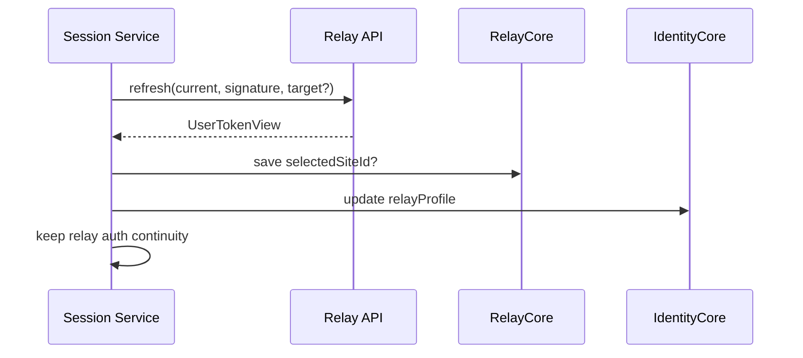

결과:

- relay 인증 연속성을 유지할 수 있습니다
- relay도 site 전환을 refresh 기반으로 처리할 수 있습니다

## 시나리오 3: 소켓 인증 연동

목적:

현재 active server에 대한 socket 연결 인증을 수행합니다.

규칙:

- socket 인증에는 유효한 `wss` endpoint가 필요합니다
- cloud `wss`는 cloud switch 과정에서 확보됩니다
- relay/cloud 모두 site 기반 socket auth는 `target = uid@sid` refresh가 선행될 수 있습니다
- `ClientSocketV2.request('auth:update', ...)` 호출로 socket 측 인증 갱신을 수행합니다
- 웹소켓 인증은 소켓 모듈이 독립적으로 수행합니다
- 웹소켓 인증 실패 시 소켓 모듈은 `web-core`의 cloud token refresh hook을 실행해 복구를 시도합니다

session 계층 책임:

- session context를 통해 endpoint와 identity token 제공
- cloud token refresh를 위한 service/hook 진입점 제공

transport/socket 계층 책임:

- socket auth 프로토콜 실행
- session이 제공한 값으로 reconnect 또는 re-authenticate 수행
- auth 실패 감지
- auth 실패 시 cloud token refresh hook 트리거
- refresh 성공 후 `auth:update` 재시도 또는 재연결 수행

복구 흐름:

1. socket 모듈이 `auth:update` 또는 인증 관련 요청 수행
2. 인증 실패 감지
3. 소켓 모듈이 `web-core`의 cloud token refresh hook 실행
4. hook 내부에서 `refreshCloudSession` 계열 service 호출
5. 최신 token 확보 후 socket 모듈이 재인증 수행

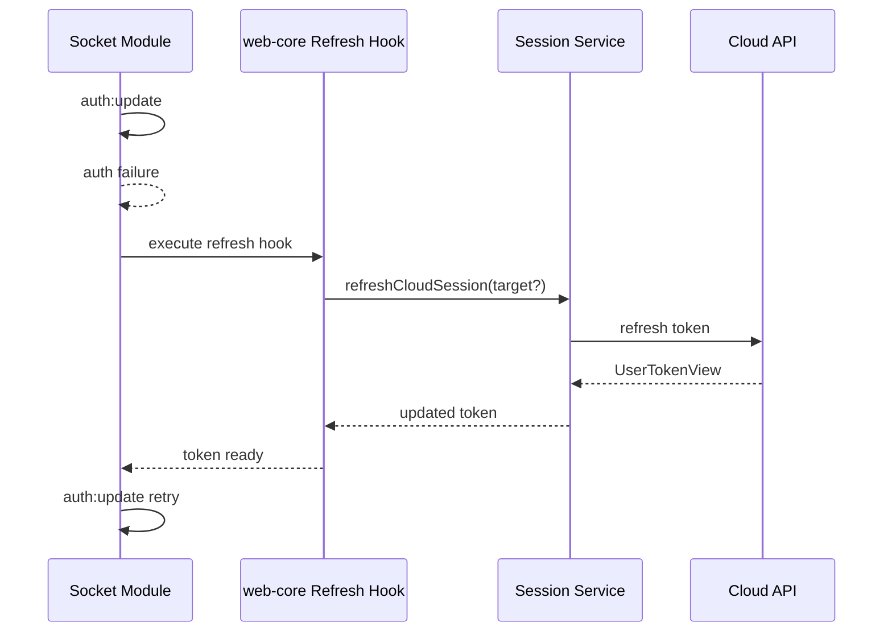

## 시나리오 4: 인증 연속성 유지

목적:

relay와 cloud 경계를 넘나들어도 세션 연속성을 유지합니다.

규칙:

- relay `http` session은 기본 연속성 기준점입니다
- relay와 cloud의 socket/http session은 auth가 유효한 동안 유지되는 것을 목표로 합니다
- continuity는 이상적인 복구 목표이지, 무조건적인 보장은 아닙니다

실패 처리:

- relay auth 유실 시 전체 logout 또는 재인증이 필요할 수 있습니다
- cloud auth 유실 시 우선 token refresh를 시도해야 합니다
- relay site 인증 맥락이 바뀌는 경우에도 우선 refresh를 통해 복구 또는 전환을 시도해야 합니다
- invite 기반 cloud 상태는 cached invite bundle에서 복원될 수 있습니다

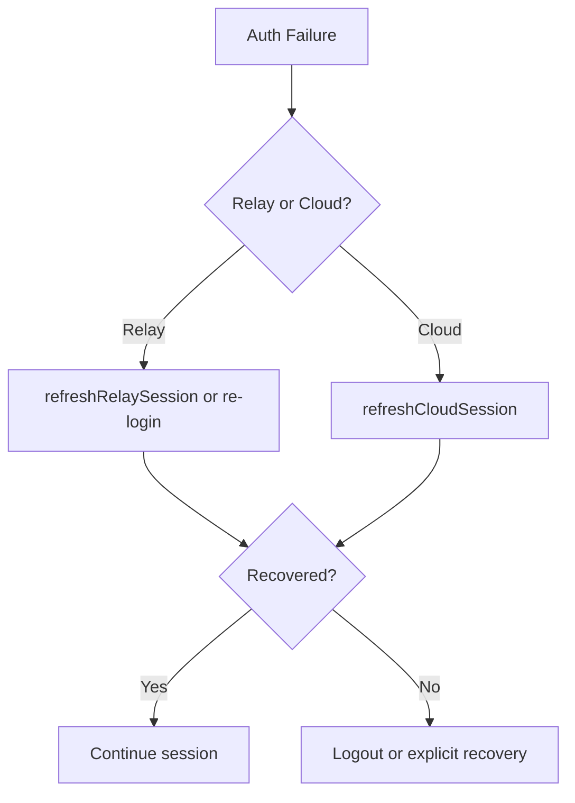

## 시나리오 5: 초대 코드 로그인 (`loginWithInviteCode`)

목적:

relay guest identity를 시작점으로 하여 초대 코드를 통해 로그인하고, 이후 cloud 진입 가능 상태를 만듭니다.

흐름:

1. 딥링크로부터 invite code 수신
2. relay 로그인 경계에서 `POST /oauth/login-invite` 호출
3. 아래 값을 전달:
    - invite code
    - target cloud backend endpoint
    - relay guest `delegatorId`
4. `UserTokenView` 응답 수신
5. 로그인 결과를 relay identity와 invite 관련 상태에 반영 (`isInvited=true`)
6. 이후 표준 cloud 흐름(`switchCloudSession`)으로 cloud 진입 (`useInviteFlow`가 구동)

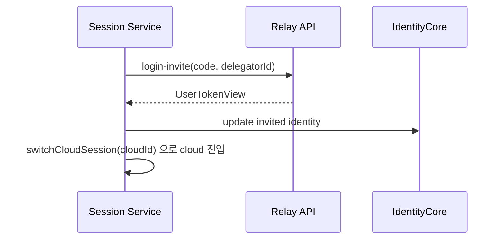

결과:

- invite는 특수 진입 방식이며, 로그인 후에는 일반 cloud session lifecycle(`switchCloudSession`)로 합류합니다

현재 구현 기준:

- relay invite login 서비스 (`loginWithInviteCode`)
- cloud 진입은 `switchCloudSession`으로 일원화 (과거 `restorePreviousCloudSession` 경로는 제거됨)

> **TODO:** 초대 cloud가 broker-delegable하지 않아 `delegate-cloud`가 404나는 케이스의 재진입 경로는 미해결. (과거 캐시 replay 방식은 번들 writer 부재로 제거됨 — 필요 시 writer 포함 재설계.)

## 시나리오 7: 중계서버 초기화 (`initializeRelaySession`)

목적:

앱 시작 시 relay 기준 세션을 최초 셋업합니다.

흐름:

1. relay transport 초기화
2. persisted state 로드
3. relay 인증 여부 확인
4. runtime 상태 갱신
5. 초기 global session context 조립

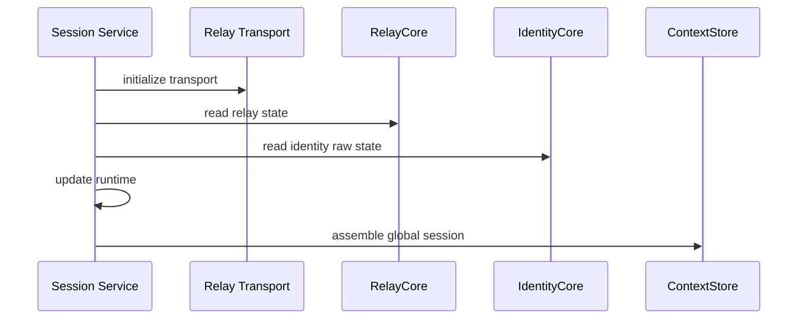

결과:

- 앱이 relay 기준 세션을 사용할 준비 상태가 됩니다

## 시나리오 8: 중계서버 로그인 (`loginRelayGuestByDevice`, `loginRelaySocial`)

목적:

relay 세션을 생성하거나 guest에서 social user로 승격합니다.

세부 흐름:

- `loginRelayGuestByDevice`
    - `deviceId`로 guest 세션 생성
    - guest token 및 identity 저장
- `loginRelaySocial`
    - native/social 인증 결과 검증
    - social token 및 identity 저장

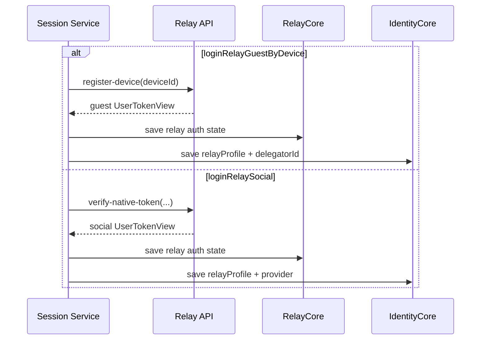

결과:

- relay 기준 인증 상태가 생성되거나 강화됩니다

delegatorId 규칙:

- 최초 앱 실행 시에는 반드시 relay 로그인(게스트)이 일어납니다. 이때 `loginRelayGuestByDevice`는 **`identityCore.delegatorId`를 반드시 저장**해야 합니다.
- 이 `delegatorId`는 이후 초대 로그인(시나리오 5)에서 `login-invite` 요청에 사용됩니다.

## 시나리오 9: 중계서버 리프레시 (`refreshRelaySession`)

목적:

relay auth refresh를 통해 기준 세션의 인증 연속성을 유지하고, 필요 시 site 전환까지 함께 수행합니다.

흐름:

1. relay refresh 호출
2. 필요 시 `target = uid@sid` 포함
3. refresh 결과 저장
4. `target`이 있으면 selected site 저장
5. 필요 시 profile 재동기화
6. runtime auth 상태 유지

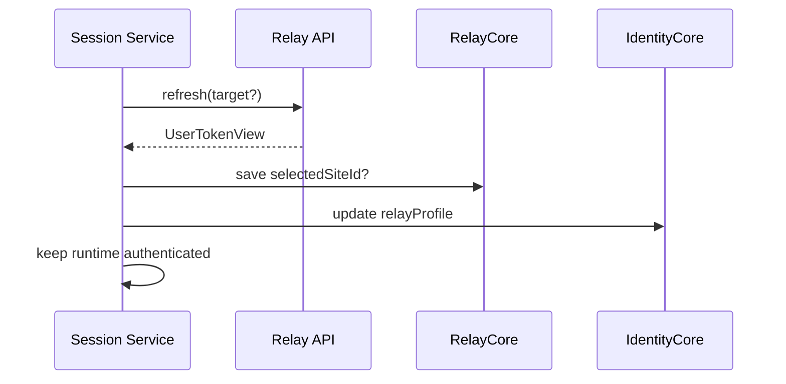

single-flight 규칙:

- relay도 site 전환이 가능하므로(`target = uid@sid`) cloud와 동일한 경합이 존재합니다. 주기 리프레시 루프(시나리오 13)의 `refreshRelaySession()`(target 없음)과 사이트 전환의 `refreshRelaySession(target = uid@sid)`가 동시 실행될 수 있습니다.
- 따라서 `refreshRelaySession`도 **서비스 레벨 single-flight**를 가집니다. in-flight refresh에 새 호출은 합류하되, target이 다르면 site-switch target을 우선해 직렬 실행합니다.
- 이 규칙은 `refreshCloudSession`(시나리오 2)과 **대칭**이며, relay/cloud 양쪽에 공통으로 적용됩니다.

## 시나리오 10: 중계서버 로그아웃 (`logoutRelaySession`)

목적:

relay 기준 전체 세션을 종료합니다.

흐름:

1. relay logout 호출
2. relay/cloud 저장 상태 정리
3. identity/runtime 상태 정리
4. 필요한 후처리 수행

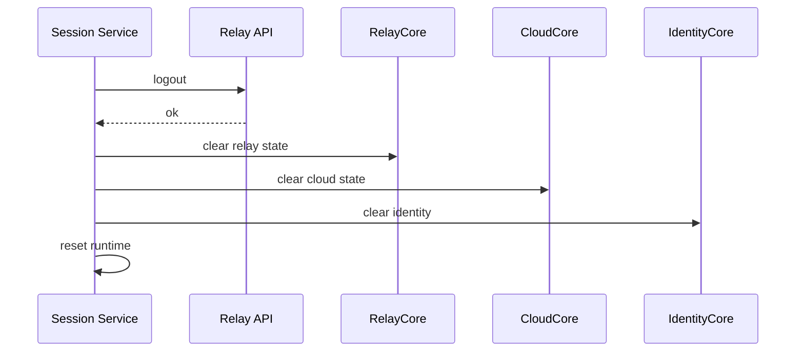

캐시 처리 규칙:

- `logoutRelaySession`은 **세션 전이만** 수행합니다. app-runtime/data·react-query 캐시는 web-core가 알지 못하므로 비우지 않습니다.
- 로그아웃 후 캐시 클리어(`DataManager.destroy()` + query cache clear)는 **외부 레이어 책임**입니다. 외부 레이어가 logout 완료를 받은 뒤 수행합니다.
- 이 캐시 클리어는 "로그아웃 후 다른 유저로 로그인 시 데이터가 꼬이는" 문제를 막기 위해 반드시 수행되어야 합니다.

## 시나리오 11: 클라우드 로그아웃 (`logoutCloudSession`)

목적:

relay 로그인은 유지한 채 cloud 세션만 해제합니다.

흐름:

1. cloud 관련 저장 상태 정리
2. selected cloud/site 제거
3. active server를 relay로 복귀
4. identity 재계산

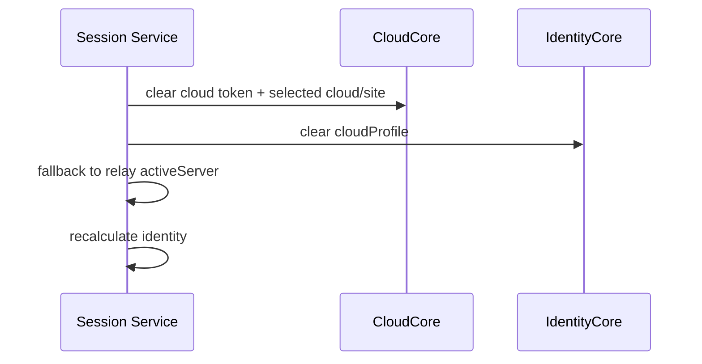

## 시나리오 12: 디바이스 등록과 아이디 저장 (`persistDeviceId`)

목적:

device 기반 인증 흐름의 선행 조건을 관리합니다.

흐름:

1. **최초 앱 실행 시 디바이스 등록 훅을 수행**합니다 (app lifecycle hook `useDynamicDeviceId`)
2. device id를 native 주입 또는 persisted 상태에서 확보합니다
3. **등록 결과 deviceId를 `identityCore`에 저장**합니다 (`persistDeviceId`가 localStorage와 `identityCore.setDeviceId`에 함께 반영)
4. guest/social login에서 재사용합니다

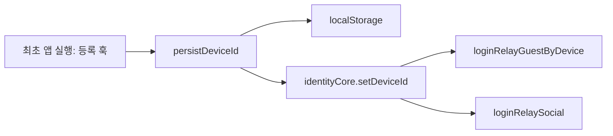

비고:

- deviceId는 identity raw state로 취급합니다 (`delegatorId`, `oAuthProvider`와 같은 계층 — context-model.md 참조).
- 기존 구현은 `localStorage`만 사용했으나, Core 저장으로 승격해 세션 read model에서 일관되게 조회할 수 있게 합니다.

## 시나리오 13: 병렬 리프레시 루프 (`useTokenRefresh`)

목적:

백그라운드에서 relay/cloud 토큰을 만료 전에 갱신해 인증 연속성을 유지합니다.

규칙:

- 기본은 relay 리프레시(`refreshRelaySession`)입니다
- cloud 서버가 연결되어 있으면(delegation token 존재) **cloud 리프레시(`refreshCloudSession`)를 병렬 수행**합니다
- cloud 리프레시는 **`cloudCore.getCloudToken()`을 credential로 사용**합니다 (cloudToken 기반)
- 주기는 1분입니다
- 사이트 전환의 refresh와 경합하지 않도록 `refreshRelaySession`(시나리오 9)·`refreshCloudSession`(시나리오 2)의 **서비스 레벨 single-flight**를 공유합니다. relay/cloud 두 축 모두 동일하게 적용됩니다

실패 폴백:

- relay 실패: `shouldLogout`이면 logout, 그 외는 다음 주기 재시도
- cloud 실패: logout하지 않고 relay를 유지, cloud를 재인증 필요로 표시해 다음 주기/소켓 401 복구에 위임
- 두 축은 독립 실패. invite 세션에서는 cloud 실패가 logout을 유발하지 않습니다

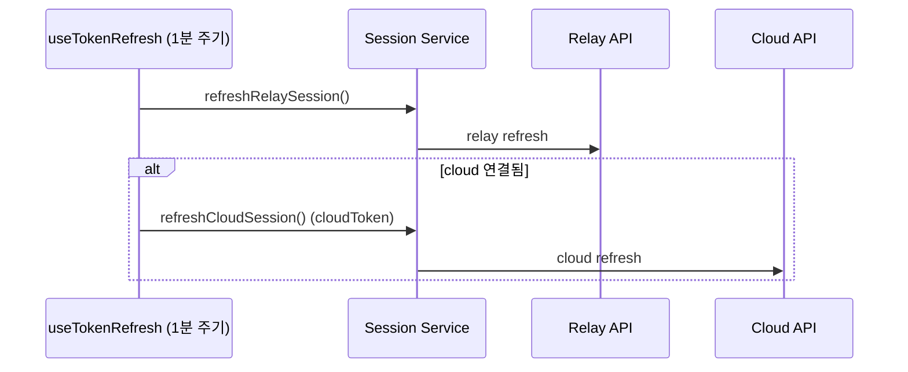

비고:

- 이 루프는 app lifecycle hook이 구동하며, 동작 정책 상세는 [hooks/orchestration.md](../hooks/orchestration.md)에 있습니다.
- 전이 자체(token 교체·저장)는 `refreshRelaySession`/`refreshCloudSession` 서비스가 소유합니다.

## 시나리오 요약 다이어그램

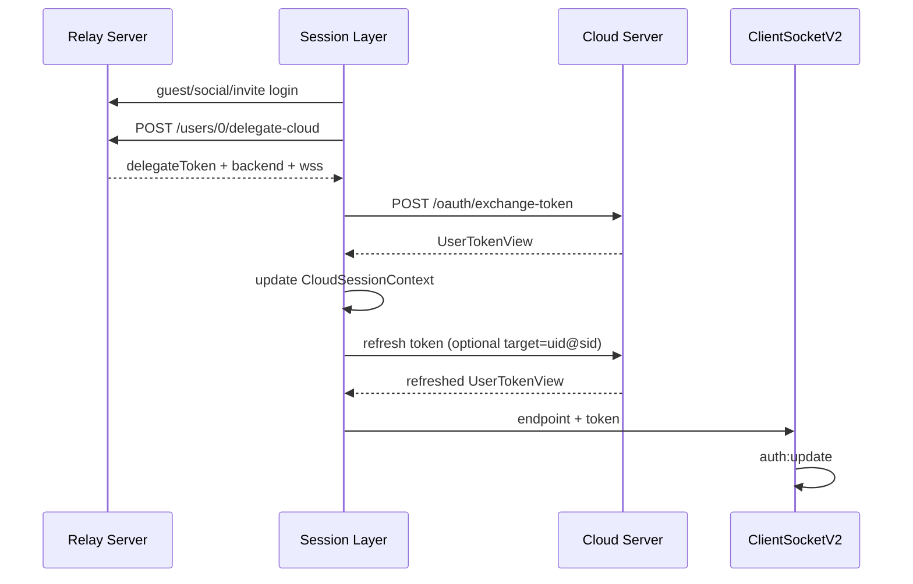

## 스펙 제약

- cloud switching이 relay endpoint ownership을 직접 변경해서는 안 됩니다
- session 소비자는 cloud와 relay 상태를 직접 손으로 조합하면 안 됩니다
- relay/cloud site token refresh는 명시적인 흐름으로 남아 있어야 합니다
- invite cache는 별도 세션 모델이 아니라 cloud session bootstrap 데이터로 취급해야 합니다
- 세션 관련 모든 변경 작업은 반드시 `session/services`를 통해서만 수행되어야 합니다
- 웹소켓 인증은 `session`이 아니라 socket 모듈의 책임입니다
- 웹소켓 인증 실패 복구는 socket 모듈이 `web-core`의 cloud token refresh hook을 호출하는 방식으로 연계합니다
