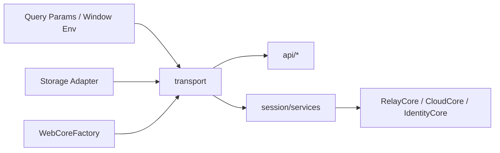

# Transport Layer

## 목적

`transport`는 `web-core`의 네트워크 런타임 경계입니다.

이 계층은 API 도메인 함수나 session service가 직접 네트워크 클라이언트 세부 구현을 알지 않도록 막고, 아래 책임을 공통으로 제공합니다.

- relay endpoint 해석
- transport 초기화
- 토큰 기반 signed request 구성
- web storage adapter 연결
- 로그아웃 시 transport 관련 토큰 정리

주요 구현 기준:

- `libs/web-core/src/transport/webTransport.ts`
- `libs/web-core/src/transport/index.ts`
- `libs/web-core/src/api/utils/request.ts`
- `libs/web-core/src/api/auth.ts`

## 책임

- `WebCoreFactory` 기반 transport 인스턴스 생성
- relay backend/wss endpoint를 runtime 기준으로 해석
- signed/unsigned request builder 제공
- relay/cloud request execution adapter 제공
- 인증 토큰 저장소와 credential 빌드 연동
- transport init의 중복 실행 방지
- deeplink/query param 기반 endpoint override 반영

## 비책임

- session 상태 조립
- relay/cloud 선택 규칙 결정
- profile/identity 계산
- socket 인증 수행

이 책임들은 각각 `session`, `...Core`, socket 모듈 경계에 속합니다.

## 핵심 개념

### 1. Transport는 네트워크 런타임이다

`transport`는 세션 도메인을 모릅니다.

알고 있는 것은 다음뿐입니다.

- 현재 사용할 storage adapter
- 초기화된 web transport 인스턴스
- request 생성 방식
- relay endpoint override 규칙

### 2. Transport는 relay/cloud 도메인 로직을 직접 갖지 않는다

relay/cloud를 구분하는 도메인 판단은 `session`과 `...Core`에서 수행합니다.

`transport`는 request를 만들고 실행하는 공통 기반만 제공합니다.

다만 현재 구현에서는 이 공통 기반 일부가 `api/utils/request.ts`에 있습니다. 문서 기준으로는 이 레이어도 transport adapter 성격으로 해석하는 것이 맞습니다.

### 3. Transport는 endpoint override를 지원한다

deeplink 또는 query param으로 `_backend`, `_wss`가 들어오면 relay endpoint를 runtime에서 override할 수 있습니다.

이 값은 `CHATIC_DOU_ENDPOINT`, `CHATIC_WS_ENDPOINT` 형태로 storage에 반영되고, `getDynamicRelayBackend()`, `getDynamicRelayWss()`가 이를 읽습니다.

## 경계 다이어그램

## Source of Truth

- transport runtime config: `window.*`, `import.meta.env.*`
- relay override endpoint: storage의 `CHATIC_*` 키
- auth credential storage: `webTransport.getTokenStorage()`
- transport init lifecycle: `pendingInit`, `initDone`

## API와의 경계

현재 `api` 계층에는 두 종류의 코드가 섞여 있습니다.

### `transport`로 보는 것이 맞는 것

- request builder 래핑
- relay/cloud signed request 실행
- endpoint helper
- cloud credential 기반 axios signing

현재 코드 위치 예:

- `libs/web-core/src/api/utils/request.ts`
- `libs/web-core/src/api/utils/func.ts`

### `api`에 남겨야 하는 것

- 도메인 endpoint 이름
- request/response 타입 매핑
- 도메인별 함수 이름

현재 코드 위치 예:

- `libs/web-core/src/api/auth.ts`
- `libs/web-core/src/api/users.ts`
- `libs/web-core/src/api/subscriptions.ts`

권장 방향:

- `api/utils/request.ts`는 장기적으로 `transport` 하위 adapter로 이동
- `api/*`는 “어떤 endpoint를 호출하는가”만 남기고 “어떻게 호출하는가”는 transport에 위임

## 관련 문서

- [runtime-model.md](./runtime-model.md)
- [request-lifecycle.md](./request-lifecycle.md)
