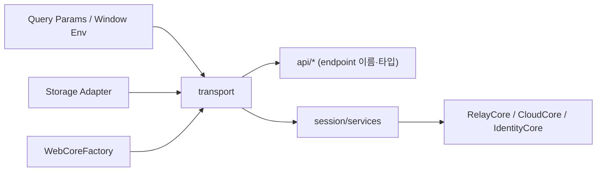

# Transport Layer

## 목적

`transport`는 `web-core`의 네트워크 런타임 경계입니다. API 도메인 함수·session service가 네트워크 클라이언트 세부를 직접 알지 않도록 막고, 아래 책임을 공통 제공합니다.

- relay endpoint 해석
- transport 초기화
- 토큰 기반 signed request 구성 + relay/cloud request 실행 adapter
- web storage adapter 연결
- 로그아웃 시 transport 토큰 정리
- 서명(lemon hmac `calcSignature` · SigV4 `signAwsRequest`)·에러 분류·재시도·네트워크 로깅

주요 구현 기준(`libs/web-core/src/transport/`):

- `webTransport.ts` — `WebCoreFactory` 기반 런타임, endpoint 해석, init lifecycle
- `request.ts` — relay/cloud request 실행 adapter (`executeRelayRequest`·`executeSignedRelayRequest`·`executeCloudRequest`·`buildCloudRequest`)
- `awsSigning.ts` — `calcSignature`(lemon hmac, relay refresh + SDK 소켓 sign 콜백), `signAwsRequest`(cloud SigV4)
- `error.ts` — `classifyError`/`handleAuthError`
- `utils.ts` — `withTimeout`/`withRetry`
- `networkLog.ts` — `withNetworkLog`(구조적 `NET` 로깅, 민감정보 redact)
- `authRuntime.ts` — OAuth credential 진입점(`snsTestLogin`·`createCredentialsByProvider`)

## 책임

- `WebCoreFactory` 기반 transport 인스턴스 생성
- relay backend/wss endpoint를 runtime 기준 해석
- signed/unsigned request builder + relay/cloud execution adapter 제공
- 인증 토큰 저장소와 credential 빌드 연동
- transport init 중복 실행 방지
- deeplink/query param 기반 endpoint override 반영

## 비책임

- session 상태 조립 (`session`)
- relay/cloud 선택 규칙 결정 (`session`/`...Core`)
- profile/identity 계산 (app 레이어)
- socket 인증 수행 (SDK `AuthController` / app-runtime)

## 핵심 개념

### 1. Transport는 네트워크 런타임이다

세션 도메인을 모릅니다. 아는 것은 storage adapter, 초기화된 transport 인스턴스, request 생성 방식, relay endpoint override 규칙뿐입니다.

### 2. relay/cloud 도메인 판단은 호출자가 한다

relay/cloud 구분은 `session`/`...Core`가 하고, transport는 request를 만들고 실행하는 공통 기반만 제공합니다. 이 실행 adapter는 **`transport/request.ts`** 에 있으며(`cloudCore`를 라이브 읽기해 cloud 요청을 서명), api 계층은 어떤 endpoint를 호출하는지만 정합니다.

### 3. endpoint override 지원

deeplink/query param으로 `_backend`/`_wss`가 들어오면 relay endpoint를 runtime override합니다. `initEnvFromQueryParams()`가 `CHATIC_*` 키로 storage에 반영하고, `getDynamicRelayBackend()`/`getDynamicRelayWss()`가 읽습니다.

## 경계 다이어그램

## Source of Truth

- transport runtime config: `window.*`, `import.meta.env.*`
- relay override endpoint: storage `CHATIC_*` 키
- auth credential storage: `webTransport.getTokenStorage()`
- transport init lifecycle: `pendingInit`, `initDone`

## api 계층과의 경계

- **transport 소유** — request builder 래핑, relay/cloud signed request 실행(`transport/request.ts`), endpoint helper, cloud credential 기반 axios signing(`awsSigning.ts`).
- **api 소유** — 도메인 endpoint 이름, request/response 타입 매핑, 도메인별 함수(`api/auth.ts`·`users.ts`·`subscriptions.ts`). api 함수는 transport helper(`executeRelayRequest` 등)를 통해서만 네트워크에 나가며 raw fetch를 쓰지 않습니다.

> 과거 이 실행 adapter는 `api/utils/request.ts`에 있었고 "transport로 옮겨야 한다"가 미결 과제였다. **이 이동은 완료됐다** — 현재 위치는 `transport/request.ts`다.

## 관련 문서

- [runtime-model.md](./runtime-model.md)
- [request-lifecycle.md](./request-lifecycle.md)
