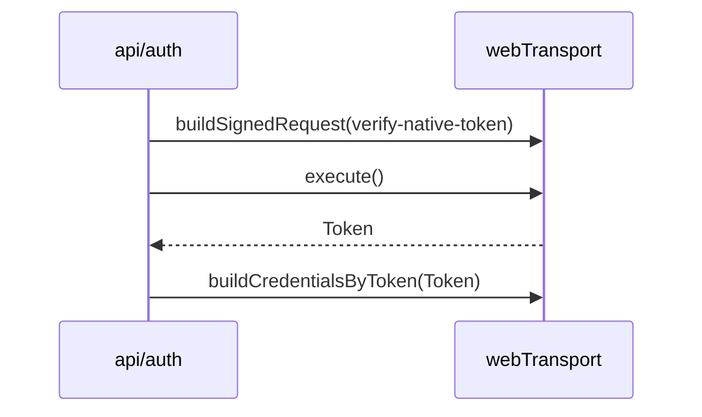
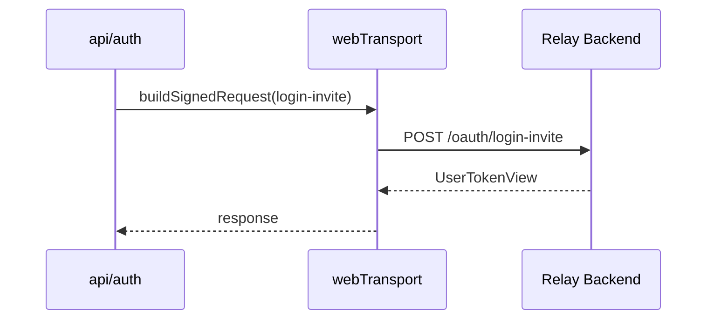
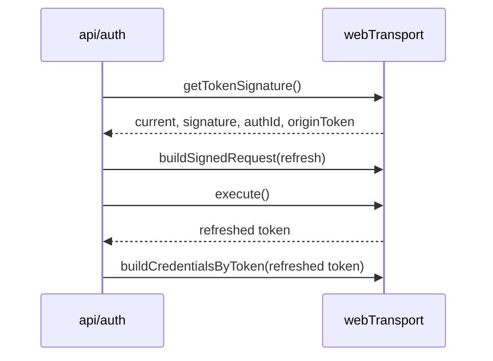

# Transport Request Lifecycle

## 목적

`transport`가 request를 어떻게 만들고, signed request와 auth credential을 어떻게 연결하는지 정의합니다.

현재 구현 기준 `transport` 책임 파일:

- `libs/web-core/src/transport/webTransport.ts` — 런타임·builder
- `libs/web-core/src/transport/request.ts` — relay/cloud execution adapter
- `libs/web-core/src/transport/awsSigning.ts` — `calcSignature`(lemon hmac)·`signAwsRequest`(SigV4)
- `libs/web-core/src/transport/{error,utils,networkLog}.ts` — 에러 분류·재시도·로깅

## 요청 종류

### 1. Unsigned Request

`buildRequest(config)`를 통해 생성합니다.

용도:

- 인증이 필요 없는 요청
- 외부에서 직접 signature를 다루지 않는 요청

### 2. Signed Request

`buildSignedRequest(config)`를 통해 생성합니다.

용도:

- relay auth가 필요한 요청
- profile 조회/수정
- invite login
- native token 검증
- auth refresh

### 3. Credential Build

`buildCredentialsByToken(token)`는 token을 credential/runtime storage에 반영하는 역할을 합니다.

용도:

- 로그인 성공 후 인증 상태 반영
- refresh 결과 반영
- social/provider login 결과 반영

### 4. Cloud Signed Request Adapter

cloud request는 `webTransport.buildSignedRequest()`만으로 끝나지 않습니다.

현재 구조에서는 아래 작업이 추가로 필요합니다.

- cloud identity token header 부착
- AWS credential 기반 signing
- axios request 실행

이 책임은 `transport/request.ts`의 `buildCloudRequest()`와 `executeCloudRequest()`에 있습니다 — `x-lemon-identity` 헤더를 `cloudCore.getIdentityToken()`에서 붙이고 `signAwsRequest(config, cloudCore.getCredential())`로 SigV4 서명합니다.

## Request Builder Contract

`TransportRequestBuilder` 계약:

```ts
interface TransportRequestBuilder {
    setBody(body: unknown): TransportRequestBuilder;
    setParams(params: Record<string, unknown>): TransportRequestBuilder;
    execute<T>(): Promise<{ data: T }>;
}
```

의미:

- builder는 mutable fluent API입니다
- request 실행은 `execute()` 시점에 일어납니다
- API 모듈은 이 builder를 조합해서 도메인 함수로 감쌉니다

보조 adapter(`transport/request.ts`):

- `executeRelayRequest()` — unsigned relay
- `executeSignedRelayRequest()` — lemon-web-core AWS-signed relay
- `executeCloudRequest()` — `buildCloudRequest` + SigV4

세 adapter 모두 `withNetworkLog`로 감싸고 `throwIfApiError`를 통과시킵니다.

## 인증 요청 흐름

### Relay Social Login



### Invite Login



### Auth Refresh



## 서명 primitive (`awsSigning.ts`)

두 서명 메커니즘이 있습니다.

- `calcSignature(payload, current, userAgent)` — lemon hmac 삼중 hmac. **relay refresh(`api/auth.ts`)와 SDK 소켓 `sign` 콜백(app-runtime `signServerAuth`)이 공유**합니다. identityToken 자리를 빈 문자열로 서명하므로 토큰 문자열에 의존하지 않습니다.
- `signAwsRequest(config, credential)` — cloud HTTP용 SigV4(`@smithy/signature-v4`, `execute-api`, `ap-northeast-2`).

즉 SDK 소켓 인증(app-runtime)이 쓰는 서명 primitive와 cloud/relay HTTP가 쓰는 것이 **동일 transport 모듈**에 있습니다. 소켓 인증 브리지 계약은 [../session/session-scenarios.md](../session/session-scenarios.md) 시나리오 3.

## 에러·재시도·로깅

- `error.ts` `classifyError` → `{ type, shouldRetry, shouldLogout, message }`(403/INVALID_TOKEN/서명 timeout=auth+logout, network/5xx=retry). `handleAuthError`는 `shouldLogout` 시 `/auth/logout` 리다이렉트.
- `utils.ts` `withTimeout`(`TIMEOUT:` 프리픽스) / `withRetry`(지수 백오프, `classifyError` 연동).
- `networkLog.ts` `withNetworkLog` — 구조적·redact된 `NET` 로그(성공/200-with-error/에러), 원 에러 re-throw.

## Session과의 관계

`transport`는 request를 실행하지만 session을 직접 변경하지 않고, `selectedCloudId`/`selectedSiteId`/`activeServer` 같은 도메인 판단도 하지 않습니다. 다만 계층은 엄격한 선형이 아닙니다 — `session/services`는 adapter·`webTransport`·`calcSignature`를 `../transport`에서 직접 import하고 도메인 함수는 `../api`에서 가져오며, `transport/request.ts`는 `cloudCore`를 `session/core`에서 읽습니다.

```text
session/services ──▶ api/* (endpoint·타입)
        │                │
        └────────────────┴──▶ transport (adapters / webTransport / signing)
                                     ▲
                            transport/request.ts ─▶ session/core (cloudCore 라이브 읽기)
```

## Endpoint 선택 규칙

relay request:

- 기본적으로 `getDynamicRelayBackend()` 또는 relay endpoint helper를 사용합니다

cloud request:

- `cloudCore.getBackend()` 등 상위 계층이 결정한 endpoint를 사용합니다

즉, transport는 endpoint 선택 로직의 최종 판단자가 아니라, 상위 계층이 정한 endpoint를 실행하는 런타임입니다.

다만 endpoint helper의 순수 runtime 해석 부분은 `api`보다 `transport`에 더 가깝습니다.

## 스펙 규칙

- 도메인 로직은 `transport`에 넣지 않습니다
- endpoint 선택 규칙은 session/core 경계에서 결정합니다
- token refresh 이후 credential 반영은 명시적인 단계로 유지합니다
- signed request와 session state mutation은 같은 계층에 두지 않습니다
- request builder, signing, cloud credential adapter는 transport 계층으로 묶는 것이 바람직합니다

## 검토 포인트

- `api/auth.ts`에서 `webTransport` 직접 사용과 `executeRelayRequest` wrapper 사용이 혼재되어 있는데, 어느 수준까지 통일할지
- `buildSignedRequest()` 사용 경계를 더 명확히 분리할지
- request builder를 유지할지, 더 좁은 helper API로 감쌀지

> execution adapter의 `transport/` 이동은 **완료**됐다(과거 `api/utils/request.ts` → 현재 `transport/request.ts`).
