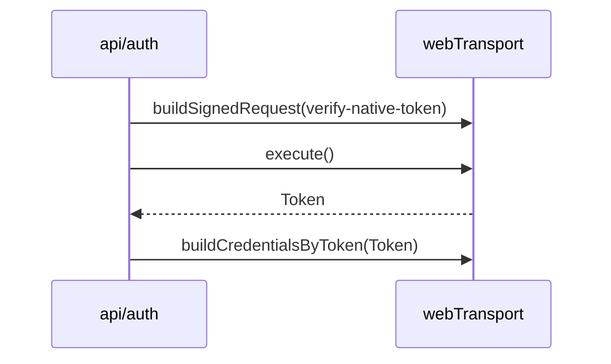
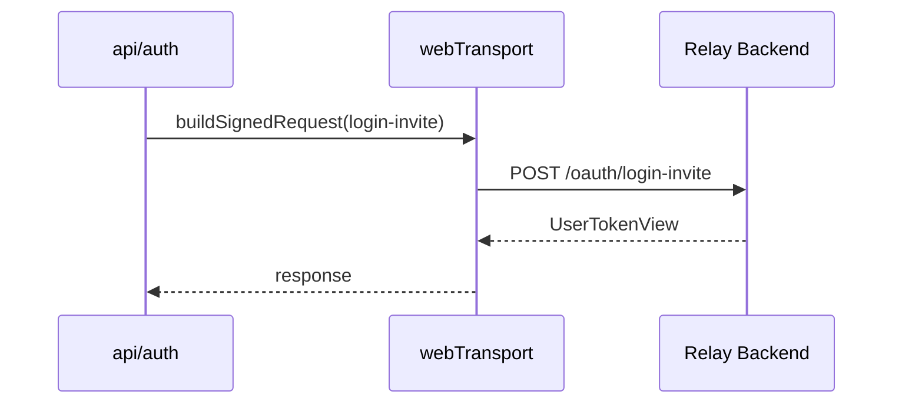
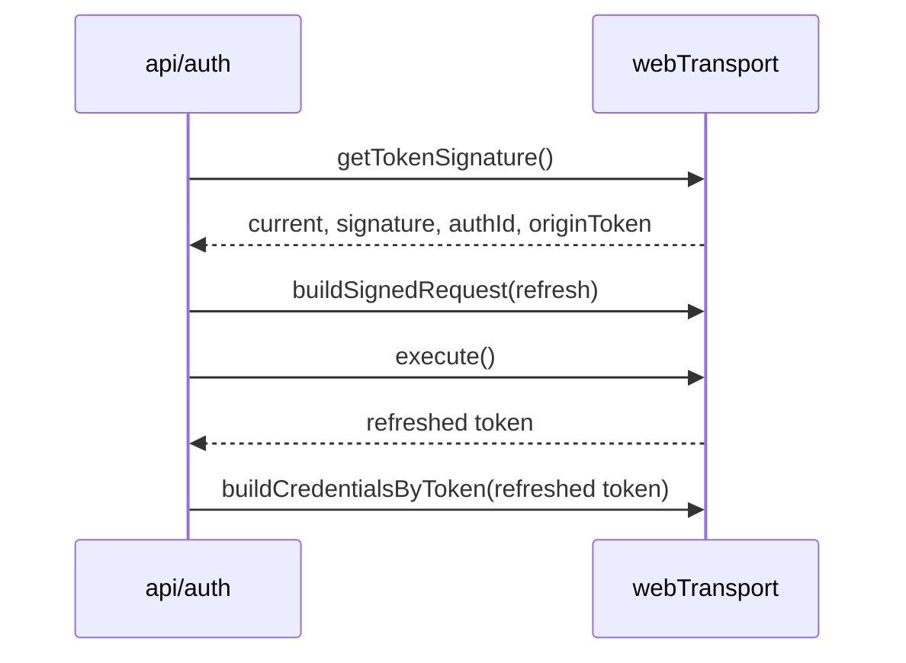

# Transport Request Lifecycle

## 목적

`transport`가 request를 어떻게 만들고, signed request와 auth credential을 어떻게 연결하는지 정의합니다.

현재 구현 기준으로는 `transport` 책임이 아래 두 파일에 나뉘어 있습니다.

- `libs/web-core/src/transport/webTransport.ts`
- `libs/web-core/src/api/utils/request.ts`

## 요청 종류

### 1. Unsigned Request

`buildRequest(config)`를 통해 생성합니다.

용도:

- 인증이 필요 없는 요청
- 외부에서 직접 signature를 다루지 않는 요청

### 2. Signed Request

`buildSignedRequest(config)`를 통해 생성합니다.

용도:

- relay auth가 필요한 요청
- profile 조회/수정
- invite login
- native token 검증
- auth refresh

### 3. Credential Build

`buildCredentialsByToken(token)`는 token을 credential/runtime storage에 반영하는 역할을 합니다.

용도:

- 로그인 성공 후 인증 상태 반영
- refresh 결과 반영
- social/provider login 결과 반영

### 4. Cloud Signed Request Adapter

cloud request는 `webTransport.buildSignedRequest()`만으로 끝나지 않습니다.

현재 구조에서는 아래 작업이 추가로 필요합니다.

- cloud identity token header 부착
- AWS credential 기반 signing
- axios request 실행

이 책임은 현재 `api/utils/request.ts`의 `buildCloudRequest()`와 `executeCloudRequest()`에 있습니다.

문서상 판단:

- 이 코드는 domain api가 아니라 transport adapter에 가깝습니다

## Request Builder Contract

`TransportRequestBuilder` 계약:

```ts
interface TransportRequestBuilder {
    setBody(body: unknown): TransportRequestBuilder;
    setParams(params: Record<string, unknown>): TransportRequestBuilder;
    execute<T>(): Promise<{ data: T }>;
}
```

의미:

- builder는 mutable fluent API입니다
- request 실행은 `execute()` 시점에 일어납니다
- API 모듈은 이 builder를 조합해서 도메인 함수로 감쌉니다

현재 보조 adapter:

- `executeRelayRequest()`
- `executeSignedRelayRequest()`
- `executeCloudRequest()`

이 함수들은 이름은 `api/utils/request.ts`에 있지만, 역할상 transport adapter에 속합니다.

## 인증 요청 흐름

### Relay Social Login



### Invite Login



### Auth Refresh



## Session과의 관계

`transport`는 request를 실행하지만 session을 직접 변경하지 않습니다.

관계 규칙:

- `api/*`는 `transport`를 사용해 HTTP 요청을 수행합니다
- `session/services`는 `api/*`와 `...Core`를 사용해 세션 상태 전이를 조정합니다
- `transport`는 `selectedCloudId`, `selectedSiteId`, `activeServer` 같은 도메인 판단을 하지 않습니다

권장 계층 재정리:

```text
session/services
  -> api/*
    -> transport adapters
      -> webTransport / axios / signing
```

## Endpoint 선택 규칙

relay request:

- 기본적으로 `getDynamicRelayBackend()` 또는 relay endpoint helper를 사용합니다

cloud request:

- `cloudCore.getBackend()` 등 상위 계층이 결정한 endpoint를 사용합니다

즉, transport는 endpoint 선택 로직의 최종 판단자가 아니라, 상위 계층이 정한 endpoint를 실행하는 런타임입니다.

다만 endpoint helper의 순수 runtime 해석 부분은 `api`보다 `transport`에 더 가깝습니다.

## 스펙 규칙

- 도메인 로직은 `transport`에 넣지 않습니다
- endpoint 선택 규칙은 session/core 경계에서 결정합니다
- token refresh 이후 credential 반영은 명시적인 단계로 유지합니다
- signed request와 session state mutation은 같은 계층에 두지 않습니다
- request builder, signing, cloud credential adapter는 transport 계층으로 묶는 것이 바람직합니다

## 검토 포인트

- `api/auth.ts`에서 `webTransport` 직접 사용과 `executeRelayRequest` wrapper 사용이 혼재되어 있는데, 어느 수준까지 통일할지
- `api/utils/request.ts`를 `transport/adapters` 같은 위치로 옮길지
- `buildSignedRequest()` 사용 경계를 더 명확히 분리할지
- request builder를 유지할지, 더 좁은 helper API로 감쌀지
