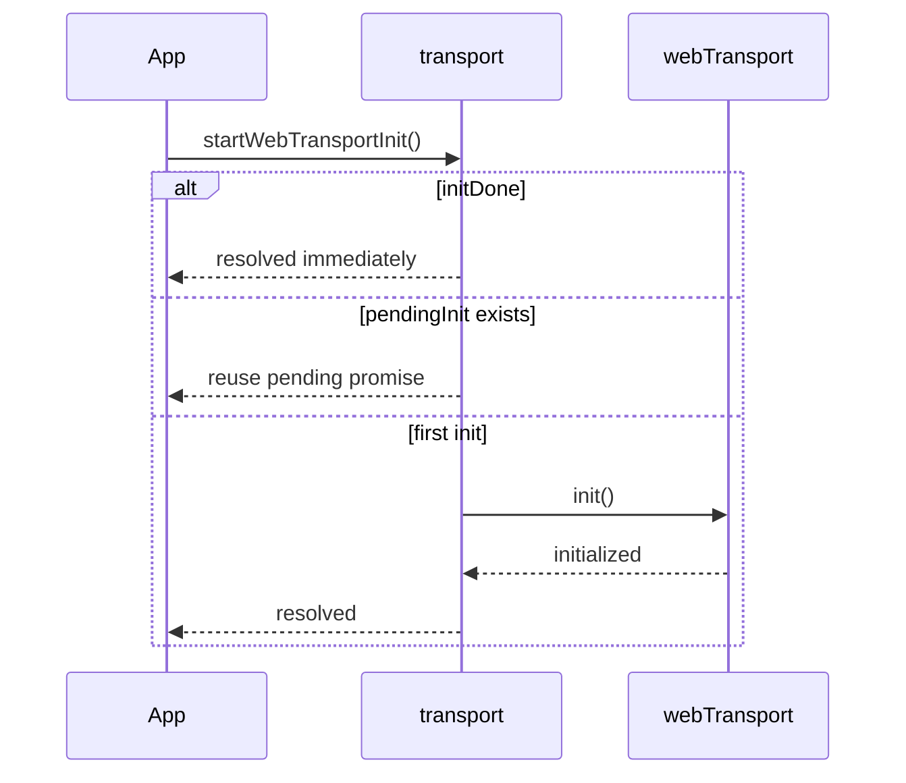
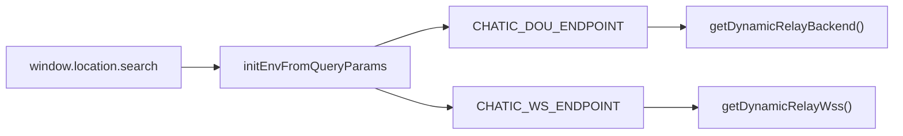

# Transport Runtime Model

## 목적

`transport` 계층이 어떤 runtime state를 가지고, 어떤 값을 source of truth로 삼는지 정의합니다.

## 주요 구성 요소

### `webTransport`

`webTransport`는 `WebCoreFactory.create(...)`로 생성된 실제 네트워크 런타임 인스턴스입니다.

주요 기능:

- `init()`
- `logout()`
- `isAuthenticated()`
- `setUseXLemonLanguage()`
- `buildRequest()`
- `buildSignedRequest()`
- `buildCredentialsByToken()`
- `getTokenSignature()`
- `getTokenStorage()`

권장 해석:

- `webTransport`는 도메인 서비스가 아니라 low-level transport runtime입니다
- session이나 api 모듈은 이 인스턴스를 직접 사용하거나 wrapper를 통해 사용합니다

현재 구조에서는 `webTransport` 단독이 아니라 다음 두 층을 합쳐 transport runtime으로 보는 것이 더 정확합니다.

- `webTransport.ts`
- `transport/request.ts`의 request execution adapter(`executeRelayRequest`·`executeSignedRelayRequest`·`executeCloudRequest`)

### Storage Adapter

storage adapter는 플랫폼에 따라 달라질 수 있습니다.

규칙:

- React Native WebView 또는 Desktop Shell이면 `localStorage`
- 그 외 기본은 `sessionStorage`

관련 구현:

- `usePersistentWebStorage`
- `setStorageAdapter(localStorage)`

### Relay Endpoint Override

relay endpoint는 정적 env만 사용하지 않습니다.

source:

- storage의 `CHATIC_DOU_ENDPOINT`
- storage의 `CHATIC_WS_ENDPOINT`
- `window.DOU_ENDPOINT`
- `window.WS_ENDPOINT`
- `import.meta.env.VITE_DOU_ENDPOINT`
- `import.meta.env.VITE_WS_ENDPOINT`

관련 함수:

- `getDynamicRelayBackend()`
- `getDynamicRelayWss()`
- `clearRelayTransportOverrides()`

### Transport Init State

transport init은 중복 실행을 방지합니다.

관리 상태:

- `pendingInit: Promise<void> | null`
- `initDone: boolean`

관련 함수:

- `startWebTransportInit()`
- `resetWebTransportInit()`

규칙:

- 초기화가 이미 끝났으면 재초기화하지 않습니다
- 초기화가 진행 중이면 같은 promise를 재사용합니다
- logout 또는 강제 reset 시 `resetWebTransportInit()`으로 상태를 되돌릴 수 있습니다

## 초기화 흐름

## Query Param Override 흐름

## 로그아웃 시 정리

transport 계층은 로그아웃 query param이 있는 경우 token 관련 storage를 정리합니다.

관련 함수:

- `clearTokensOnLogout()`

주의:

- 이 정리는 session logout과 별개로 transport runtime 부트스트랩 시점에 수행됩니다
- 따라서 logout 후 redirect URL 정책과 결합되어 동작합니다

## 설계 판단

좋은 점:

- init 중복 실행 방지 로직이 명확합니다
- endpoint override가 relay runtime과 분리되어 있습니다
- request builder와 credential builder가 한 곳에 모여 있습니다

검토 포인트:

- `webTransport`가 너무 많은 역할을 갖고 있는지
- logout token 정리가 transport bootstrap 시점에 있는 것이 적절한지
- storage adapter 선택이 session 정책과 충분히 분리되어 있는지

> request execution adapter의 `transport/` 이동은 **완료**됐다(과거 `api/utils/request.ts` → 현재 `transport/request.ts`).

## 관련 문서

- [README.md](./README.md) — transport 계층의 역할과 경계
- [request-lifecycle.md](./request-lifecycle.md) — request builder와 auth 흐름
