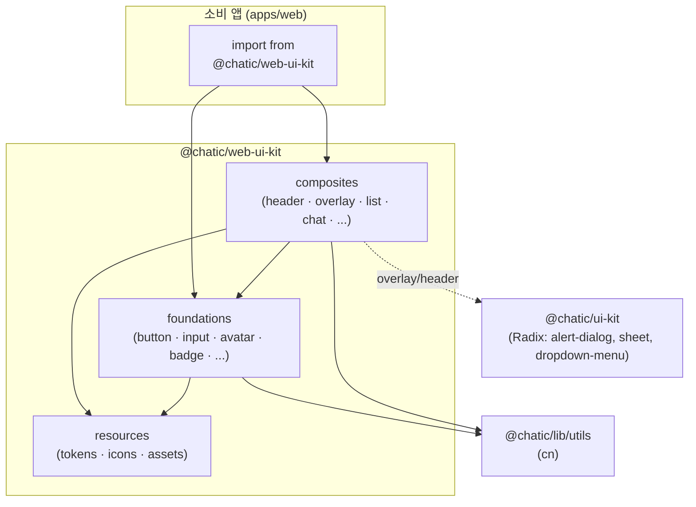

# web-ui-kit

> 최종 갱신: 2026-07-15 · 대상 경로: `libs/web-ui-kit`

모바일 웹 앱(`apps/web`)의 Figma 디자인 시스템을 코드로 구현한 컴포넌트 라이브러리. 패키지명 `@chatic/web-ui-kit`.

## 개요

`@chatic/ui-kit`(shadcn 기반 공용 프리미티브, `web`/`desktop-web`/`admin` 공유)과 달리, 이 라이브러리는 **모바일 웹 전용**으로 Figma 스펙의 화면 단위 빌딩 블록(헤더, 플로팅 CTA, 아바타, 리스트 행 등)을 담는다. 오버레이 같은 일부 컴포넌트는 내부적으로 `@chatic/ui-kit`의 Radix 프리미티브(`alert-dialog`, `sheet`)를 조합한다.

핵심 설계 원칙(코드 전반에서 일관 적용):

- **Stateless · slot 기반**: 도메인/데이터/i18n에 결합하지 않는다. 텍스트·아바타·액션은 prop/슬롯으로 주입받고, 상태(열림/펼침 등)는 호스트가 소유한다.
- **i18n-agnostic**: aria-label 등은 영어 기본값 + prop 오버라이드(`switcherLabel`, `backLabel`, `label` 등). 번역은 소비 앱이 주입한다.
- **디자인 토큰만 사용**: 색상은 `resources/styles/tokens.css`의 시맨틱 토큰(`text-foreground`, `bg-surface`, `bg-brand-ink`, `text-main-accent` 등). raw hex 금지.
- **아이콘 단일 출처**: 컴포넌트는 `lucide-react`를 직접 import하지 않고 [resources/icons](src/resources/icons/index.ts)의 `Icon*` 별칭만 사용한다.
- **클래스 병합**: `cn`은 `@chatic/lib/utils`에서 import.
- 컴포넌트마다 `*.test.tsx`(Jest + Testing Library)와 `*.stories.tsx`(Storybook) 동반.

## 구조

3계층(resources → foundations → composites)으로 나뉘며, 상위 계층이 하위 계층을 조합한다.

```
libs/web-ui-kit/src/
├── resources/              # 디자인 원자원 (색/토큰/아이콘/에셋)
│   ├── styles/tokens.css   # HSL 시맨틱 토큰 (라이트/다크)
│   ├── icons/              # lucide 재노출 단일 출처 + DefaultPlaceIcon
│   └── assets/             # dou-logo.svg, dou-mark.svg (번들러 URL export)
├── foundations/            # 기본 컴포넌트 (단일 책임)
│   ├── avatar/             # ProfileAvatar · PlaceAvatar · ChatAvatar (+ avatarBase 내부 공유)
│   ├── badge/              # Badge · PlanBadge · StatusBadge · UnreadBadge · VerifiedBadge
│   ├── bubble/             # MessageBubble
│   ├── button/             # Button · OutlineButton · FloatingButton · InlineActionButton
│   │                       #   IconButton · ButtonGroup · SubscriptionButton · TextLink (+ floatingPanel)
│   ├── input/              # TextField · SearchInput · MessageInput · VerificationCodeInput
│   ├── checkbox/ · switch/ · divider/ · text/ · toast/
├── composites/             # foundations 조합 (화면 블록)
│   ├── header/             # AppHeader · ChatRoomHeader · ModalTopBar
│   ├── overlay/            # AlertDialog · BottomSheet · SheetOption  (@chatic/ui-kit Radix 위)
│   ├── layout/             # ListSection · ScreenLayout
│   ├── section/            # SectionHeader · GroupLabel
│   ├── list/               # ListRow · SelectableUserItem
│   ├── chat/               # MessageRow · DateDivider · SystemMessage
│   ├── feedback/           # EmptyState
│   └── subscription/       # BenefitItem
└── index.ts                # 공개 배럴 (resources → foundations → composites 순 재노출)
```

- **AppHeader** ([composites/header/AppHeader.tsx](src/composites/header/AppHeader.tsx)): 홈 상단 헤더. `kind="no-cloud"`(DoU 브랜드 마크+chevron) / `kind="cloud"`(클라우드 아바타+이름+chevron), 우측은 구독 배지(`planTier`)+검색+프로필 공통. 프로필 `avatar`를 생략하면 기본 글리프로 폴백. `switcherMenu` 슬롯에 DropdownMenu를 넣으면 Radix가 열림 상태를 소유.
- **ListRow** ([composites/list/ListRow.tsx](src/composites/list/ListRow.tsx)): 설정/메뉴/멤버 행의 범용 프리미티브. leading/trailing 슬롯, `onClick` 시 button, rest-props 통과.
- **Button** ([foundations/button/Button.tsx](src/foundations/button/Button.tsx)): 버튼 시스템의 기반(solid/outline/ghost × green/black/gray). Outline/Floating/Subscription/InlineAction 프리셋이 이를 확장.

## 다이어그램



## API

공개 진입점은 배럴 하나뿐 — [src/index.ts](src/index.ts). 소비 측은 항상 패키지 루트에서 import한다.

```ts
import { AppHeader, ListRow, Button, TextField, PlanBadge } from '@chatic/web-ui-kit';
import { IconSearch, douLogo } from '@chatic/web-ui-kit'; // 아이콘/에셋도 동일 배럴
```

노출 심볼(계층별):

- **resources**: `Icon*`(ArrowUp/Check/CircleAlert/ChevronDown/House/ChevronLeft/ChevronRight/Loader2/MessageCircle/More/Plus/Search/Sparkles/User/X/Zap 등 별칭), `DefaultPlaceIcon`, `douLogo`, `douMark`
- **foundations**: `Button` `ButtonGroup` `OutlineButton` `FloatingButton` `InlineActionButton` `IconButton` `SubscriptionButton` `TextLink` · `TextField` `SearchInput` `MessageInput` `VerificationCodeInput` · `ProfileAvatar` `PlaceAvatar` `ChatAvatar` · `Badge` `PlanBadge` `StatusBadge` `UnreadBadge` `VerifiedBadge` · `MessageBubble` · `Checkbox` `Switch` `Divider` `Text` `Toast`
- **composites**: `AppHeader` `ChatRoomHeader` `ModalTopBar` · `AlertDialog` `BottomSheet` `SheetOption` · `ListSection` `ScreenLayout` · `SectionHeader` `GroupLabel` · `ListRow` `SelectableUserItem` · `MessageRow` `DateDivider` `SystemMessage` · `EmptyState` · `BenefitItem`

각 컴포넌트는 `*Props` 인터페이스를 export하며 `className` 통과를 지원한다. 모든 prop에는 JSDoc이 달려 있으니 소스가 곧 API 문서다.

## 사용 방법

**토큰 로드(필수)**: 색상은 CSS 변수 기반이라 소비 앱(또는 Storybook 프리뷰)이 [src/resources/styles/tokens.css](src/resources/styles/tokens.css)의 토큰을 로드해야 한다. `apps/web`는 자체 tailwind config가 동일 토큰을 정의하고 `createGlobPatternsForDependencies`로 이 라이브러리 소스를 content 스캔에 포함한다.

**컴포넌트 조합 예시** (헤더 — 구독 배지는 `planTier`로 노출, i18n 라벨은 앱이 주입):

```tsx
import { AppHeader, ProfileAvatar } from '@chatic/web-ui-kit';

<AppHeader
    kind="cloud"
    name={cloudName}
    onSwitcher={openCloudSwitch}
    planTier="pro"
    onPlanClick={goToSubscription}
    onSearch={openSearch}
    avatar={<ProfileAvatar src={photo} size={36} />}
    onProfile={goToProfile}
    switcherLabel={t('homeHeader.selectCloud')}
    searchLabel={t('homeHeader.search')}
    profileLabel={t('homeHeader.profile')}
/>;
```

**개발 커맨드** (Nx 추론 타깃 — `project.json` targets는 비어 있고 플러그인이 주입):

```bash
nx test web-ui-kit            # Jest 단위 테스트
nx lint web-ui-kit            # ESLint
nx storybook web-ui-kit       # 컴포넌트 쇼케이스 (QA/디자이너용)
nx build-storybook web-ui-kit # 정적 Storybook 사이트 빌드
nx build web-ui-kit           # 라이브러리 빌드
```
