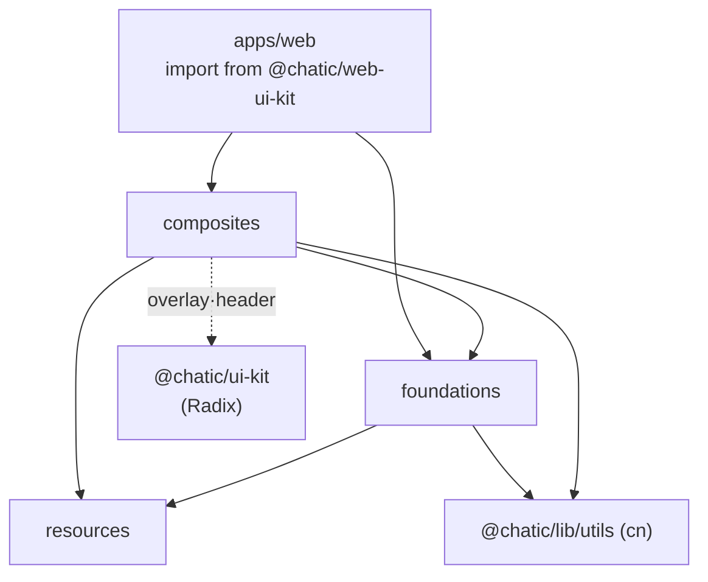

# @chatic/web-ui-kit

`apps/web`(모바일 웹) 전용 디자인 시스템 구현. Figma 스펙의 화면 단위 빌딩 블록을 담는다.

`@chatic/ui-kit`(shadcn 기반 공용 프리미티브, web·desktop-web·admin 공유)과는 다른 물건이다.
이쪽은 모바일 웹 전용이고, 오버레이 같은 일부 컴포넌트가 내부적으로 `@chatic/ui-kit`의 Radix
프리미티브를 조합한다. **desktop-web은 이 lib을 쓰지 않는다**(import 0건 — 별도 스택).

## 지켜야 할 다섯 가지

- **Stateless · slot 기반.** 도메인·데이터·i18n에 결합하지 않는다. 텍스트·아바타·액션은
  prop/슬롯으로 받고, 열림/펼침 같은 상태는 호스트가 소유한다.
- **i18n-agnostic.** `aria-label` 등은 영어 기본값 + prop 오버라이드(`switcherLabel`·`backLabel`
  ·`label`). 번역 주입은 소비 앱 몫이다.
- **디자인 토큰만.** 색은 [`resources/styles/tokens.css`](src/resources/styles/tokens.css)의
  시맨틱 토큰(`text-foreground`·`bg-surface`·`bg-brand-ink`·`text-main-accent` …). raw hex 금지.
- **아이콘 단일 출처.** 컴포넌트는 `lucide-react`를 직접 import하지 않고
  [`resources/icons`](src/resources/icons/index.ts)의 `Icon*` 별칭만 쓴다.
- **컴포넌트마다 `*.test.tsx` + `*.stories.tsx`를 동반한다.** 클래스 병합 `cn`은
  `@chatic/lib/utils`에서 가져온다.

## 구조 — 3계층

상위가 하위를 조합하고, 역방향은 없다.

```
resources/    디자인 원자원 — styles/tokens.css · icons/ (lucide 재노출) · assets/
   ↑
foundations/  단일 책임 컴포넌트 — avatar · badge · brand · bubble · button
              checkbox · divider · input · switch · text · toast
   ↑
composites/   화면 블록 — chat · feedback · header · layout · list
              navigation · overlay · section · subscription
```



## 무엇이 있는지 — 목록을 여기 두지 않는다

공개 진입점은 배럴 하나뿐이다([src/index.ts](src/index.ts)). 소비 측은 항상 패키지 루트에서
import한다.

```ts
import { AppHeader, ListRow, Button, TextField, PlanBadge } from '@chatic/web-ui-kit';
import { IconSearch, douLogo } from '@chatic/web-ui-kit'; // 아이콘·에셋도 같은 배럴
```

컴포넌트가 80종을 넘고 계속 는다. **손으로 적은 목록은 반드시 낡으므로 여기 두지 않는다** —
이 README가 실제로 그랬다(2026-07-15 기준 목록이 2026-09에 절반 가까이 어긋나 있었다). 찾는
방법은 둘이다.

```bash
nx storybook web-ui-kit          # 눈으로 고른다 — QA·디자이너용 쇼케이스
```

```bash
grep -rn '^export' libs/web-ui-kit/src/index.ts   # 배럴이 재노출하는 계층
```

각 컴포넌트는 `*Props`를 함께 export하고 모든 prop에 JSDoc이 달려 있다 — **소스가 곧 API
문서다.**

## 쓰는 쪽에서 할 일

**토큰 로드가 필수다.** 색이 CSS 변수 기반이라 소비 앱(또는 Storybook 프리뷰)이
`resources/styles/tokens.css`의 토큰을 로드해야 한다. `apps/web`는 자체 tailwind config가 같은
토큰을 정의하고 `createGlobPatternsForDependencies`로 이 lib 소스를 content 스캔에 포함한다.

```tsx
import { AppHeader, ProfileAvatar } from '@chatic/web-ui-kit';

<AppHeader
    kind="cloud"
    name={cloudName}
    onSwitcher={openCloudSwitch}
    planTier="pro"
    onSearch={openSearch}
    avatar={<ProfileAvatar src={photo} size={36} />}
    onProfile={goToProfile}
    switcherLabel={t('homeHeader.selectCloud')} // i18n은 앱이 주입
/>;
```

## 커맨드

`project.json`의 `targets`는 비어 있고 Nx 플러그인이 추론해 넣는다.

```bash
nx test web-ui-kit
nx lint web-ui-kit
nx storybook web-ui-kit
nx build web-ui-kit
```

## 아바타는 통합 제안이 열려 있다

아바타 컴포넌트가 7종(`AvatarGroup`·`ChatAvatar`·`CloudAvatar`·`DefaultAvatar`·`ImageAvatar`·
`PlaceAvatar`·`ProfileAvatar`)으로 나뉘어 링 토큰과 사이즈 스케일이 서로 어긋나 있다. variant
기반 단일 `Avatar`로 수렴시키는 안이 승인됐지만 **Figma 판독 단계에서 막힌 채 미착수다** —
제안·불일치 목록·마이그레이션 순서는 [아바타 통합 스펙](../../docs/specs/avatar-unification.md).
지금 코드를 고칠 때는 현행 7종 기준으로 하면 된다.
