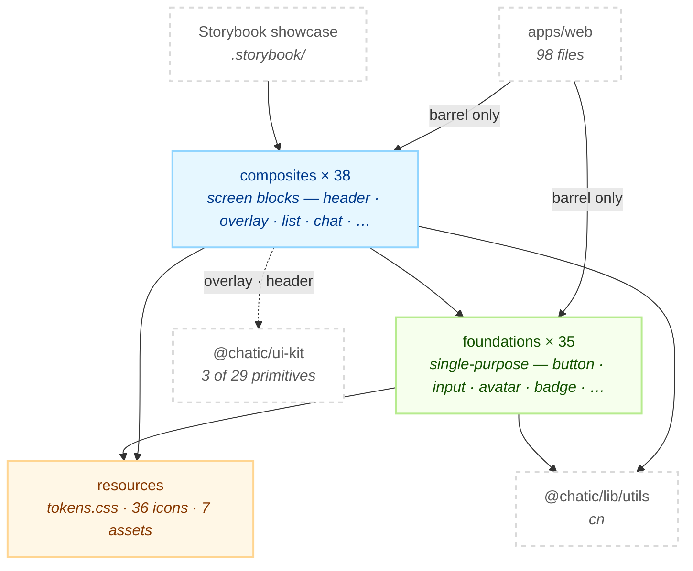
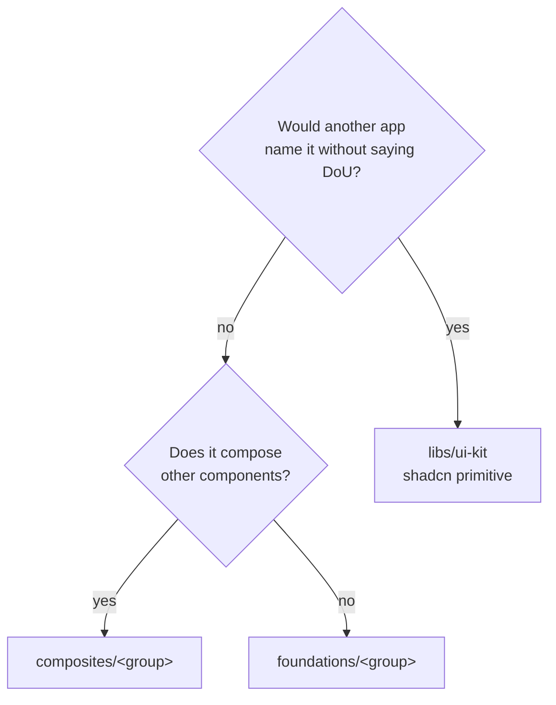

# @chatic/web-ui-kit

**The Figma design system of the mobile web app, as components.** It holds the screen-shaped building
blocks `apps/web` renders — headers, list rows, chat bubbles, bottom sheets, avatars, the token set
they are coloured from and the icon set they draw — and exports every one of them through a single
barrel.

It is not the repo's generic component library. That is [`libs/ui-kit`](../ui-kit), and the line
between the two is the first thing to get right — see [The boundary with
`libs/ui-kit`](#the-boundary-with-libsui-kit).

## Purpose

`apps/web` is the only consumer, and it sees the `@chatic/web-ui-kit` barrel and nothing else.
Imports that reach past it into internal paths number **zero**, which is why the directory tree here
can be rearranged with no blast radius outside the lib.

```bash
grep -rn "@chatic/web-ui-kit/" --include='*.ts' --include='*.tsx' apps libs | grep -v node_modules
```

This lib **owns no state, no data and no copy.** It does not fetch, it does not know a domain model,
and it does not translate. Text and avatars arrive as props or slots, open/expanded state is owned by
the host, and `aria-label` defaults are English strings a caller overrides. Everything above that —
the screens, the hooks, the i18n catalogue — is `apps/web`.

## The boundary with `libs/ui-kit`

Two component libraries sit side by side, and the split is not by quality or by age. It is this:

|                    | `libs/ui-kit`                                                            | `libs/web-ui-kit` (here)                                       |
| ------------------ | ------------------------------------------------------------------------ | -------------------------------------------------------------- |
| What it is         | 29 shadcn/ui primitives under `src/components/ui/`, plus the `cn` helper | The DoU mobile design system                                   |
| Named after        | The interaction — `dialog`, `sheet`, `popover`, `tabs`                   | The place on screen — `AppHeader`, `ChatRoomHeader`, `ListRow` |
| Where it came from | `npx shadcn@latest add <name>` — regenerable                             | A Figma node, drawn by hand against the spec                   |
| Who uses it        | `apps/web`, `apps/desktop-web`, `apps/admin-v2`, `libs/shared`           | `apps/web` only                                                |
| Decides            | Focus, portal, ARIA, dismiss — behaviour                                 | Spacing, colour, type, glyph — appearance                      |

**The rule: a component belongs in `ui-kit` when more than one app could name it without saying
"DoU", and here when it only makes sense inside a DoU mobile screen.** `Sheet` is a sheet anywhere.
`BottomSheet` — rounded top, drag handle, safe-area inset, keyboard-aware footer — is this app's
sheet.

The dependency runs **one way: this lib imports `ui-kit`, `ui-kit` never imports this lib.** That is
what keeps `desktop-web` and `admin-v2` free of mobile-web components.

It is also a thin arrow. Production code here reaches into `ui-kit` for **3 of its 29 primitives**,
in 4 files:

```bash
grep -rn "@chatic/ui-kit/components" libs/web-ui-kit/src --include='*.tsx' | grep -v '\.stories\.'
```

`alert-dialog` and `sheet` (overlay), `dropdown-menu` (both headers). Every one of them is pulled in
for Radix behaviour that is not worth reimplementing — focus trap, portal, escape and overlay
dismiss, ARIA wiring. Nothing visual is pulled in: `AlertDialog.tsx` goes as far as importing
`@radix-ui/react-alert-dialog` directly for the raw `Cancel`/`Action` nodes, because `ui-kit`'s
styled wrappers inject `buttonVariants` and `mt-2` through a Radix `Slot`, which concatenates rather
than tailwind-merges and breaks the two-up action row.

`cn` is the one other thing taken from that package, as `@chatic/lib/utils` — 71 files import it.

## Design principles

1. **Stateless and slot-based.** A component takes what it draws and reports what was clicked. Open,
   expanded and selected state lives in the host. `AppHeader`'s `switcherMenu` is a slot precisely so
   Radix owns the open state, not this lib.
2. **i18n-agnostic.** Labels default to English (`selectLabel = 'Select photo'`) and every one is a
   prop. A Korean string hard-coded in a component is a bug; a Korean string in a JSDoc comment
   naming a Figma layer is not.
3. **Semantic tokens, not colours.** Components use `text-foreground`, `bg-surface`, `bg-brand-ink`,
   `border-avatar-ring` — never a raw hex. The exception is deliberate and documented in place:
   `CloudAvatar`'s 8-colour name-hash palette is a rotation, not a meaning, so it has no semantic
   token. Two more are drift, not exception. The grep, not this sentence, is the check:

    ```bash
    grep -rnE "(bg|text|border)-\[#" libs/web-ui-kit/src --include='*.tsx' | grep -v '\.stories\.'
    ```

4. **One icon source.** Exactly one file imports `lucide-react` — `resources/icons/index.ts` — and
   components import `Icon*` aliases from it. Swapping the icon library later touches that file and
   nothing else. An alias with no current caller is the normal state of a kit barrel, not dead code.
5. **Layers only point down.** `composites` → `foundations` → `resources`, and never back up. A
   foundation that needs a composite is a sign the composite is in the wrong layer.
6. **Every component has a test and a story.** 75 spec files and 65 story files against 73 exported
   components. The story is the visual contract for QA and design; the test is the behavioural one.

## Scope

**In** — Figma-spec components for the mobile web app, the semantic token sheet they resolve against,
the icon aliases and brand assets they draw, and the Storybook showcase that renders all of it.

**Out** — the shadcn/ui primitives (`libs/ui-kit`); anything `apps/desktop-web` or `apps/admin-v2`
renders (they use `libs/ui-kit` directly and import nothing from here); screen composition, routing,
data and translation (`apps/web`); the block-renderer components (`libs/block-kit`).

## Structure



Arrows never point up. `foundations` imports no composite, `resources` imports nothing at all, and
foundation groups do not import each other — `avatar` knows nothing about `badge`. Composites compose
each other exactly once, `ListSection` → `SectionHeader`.

### Where a component goes



### Directories

```text
libs/web-ui-kit/src/
├── index.ts       public barrel — resources, then foundations, then composites
├── resources/
│   ├── styles/tokens.css   105 lines of HSL channels, light + `.dark`
│   ├── icons/              36 exports: lucide aliases + Figma-exported glyphs
│   └── assets/             7 brand images, exported as bundler-resolved URLs
├── foundations/   11 groups, 35 components
│   avatar(7) · button(9) · input(6) · badge(5) · brand(2) ·
│   bubble · checkbox · divider · switch · text · toast (1 each)
└── composites/    9 groups, 38 components
    chat(12) · list(5) · overlay(4) · section(4) · header(3) ·
    layout(3) · subscription(3) · feedback(2) · navigation(2)
```

Three files are internal — used across a group but absent from every barrel, so grepping the public
API will not find them:

- `foundations/avatar/avatarBase.tsx` — `AvatarShell`, the ringed circle `ChatAvatar` and
  `PlaceAvatar` are both drawn on.
- `foundations/button/floatingPanel.ts` — the shared class string for floating surfaces.
- `composites/header/HeaderGlass.tsx` — the blurred header backdrop.

## Usage

One entry point: the package root.

```ts
import { AppHeader, Button, IconSearch, ListRow, PlanBadge, ProfileAvatar, douLogo } from '@chatic/web-ui-kit';
```

Icons and image assets come out of the same barrel as components. Every component exports a `*Props`
interface, accepts `className`, and carries JSDoc on each prop naming the Figma node it implements —
the source is the API reference, and there is no generated one.

```tsx
<AppHeader
    kind="cloud"
    name={cloudName}
    onSwitcher={openCloudSwitch}
    planTier="pro"
    onPlanClick={goToSubscription}
    onSearch={openSearch}
    avatar={<ProfileAvatar src={photo} size={36} />}
    onProfile={goToProfile}
    switcherLabel={t('homeHeader.selectCloud')}
    searchLabel={t('homeHeader.search')}
    profileLabel={t('homeHeader.profile')}
/>
```

### Wiring

Nothing is assembled here — there is no provider and no root component to mount. What a host has to
supply is the token layer the classes resolve against, and the two hosts do it differently:

```text
Storybook    .storybook/preview.css  →  @import src/resources/styles/tokens.css
                                        + libs/web-ui-kit/tailwind.config.js

apps/web     src/styles.css          →  re-declares the same custom properties
                                        + apps/web/tailwind.config.js, whose content globs
                                          reach this lib through createGlobPatternsForDependencies
```

`apps/web` does **not** import `tokens.css`. The two files hold the same variables and are kept in
parity by hand, which is why both carry comments pointing at each other. A token added here without
being added to `apps/web/src/styles.css` renders correctly in Storybook and transparent in the app.

## Scenarios

### 1. Adding a component

Decide the layer with the diagram above, then add three files to the group — `Thing.tsx`,
`Thing.test.tsx`, `Thing.stories.tsx` — and one line to the group's `index.ts`. Nothing needs
touching at the `src/index.ts` level: the top barrel re-exports whole groups.

### 2. Adding an icon

A lucide glyph becomes a semantic alias in `resources/icons/index.ts`
(`export const IconPin: LucideIcon = Pin`). A Figma-exported glyph with no lucide equivalent becomes
its own `IconThing.tsx` in the same folder and is re-exported from that barrel. Never import
`lucide-react` from a component.

### 3. Reaching for a Radix primitive

Import it from `@chatic/ui-kit/components/ui/<name>` and restyle the content node. If the styled
wrapper's own classes fight the Figma layout — the concatenation problem `AlertDialog.tsx` hit — drop
to `@radix-ui/react-<name>` for that node only and leave a comment saying why. Do not restyle the
primitive inside `libs/ui-kit`: three other consumers render it.

### 4. Picking an avatar

Seven components draw a circle and they are not interchangeable.

| Component       | Use when                                                                                                                                                            |
| --------------- | ------------------------------------------------------------------------------------------------------------------------------------------------------------------- |
| `ImageAvatar`   | A photo URL exists and nothing else is needed. Numeric `size`, default 46                                                                                           |
| `ProfileAvatar` | The 86px profile circle, with a `+` badge when `onSelect` is passed. Absorbs the photo-missing fallback itself through `glyph`: `user` / `group` / `place` / `home` |
| `DefaultAvatar` | A person or room with no photo, in a list row or header. `variant`: `user` / `group`                                                                                |
| `PlaceAvatar`   | A place's initial on the single brand disc — every place shares one tone                                                                                            |
| `CloudAvatar`   | A cloud's initial on a tone hashed from its name, so a cloud keeps its colour                                                                                       |
| `ChatAvatar`    | A chat with no photo — a speech bubble on a faint navy tint                                                                                                         |
| `AvatarGroup`   | Overlapping stack plus a member count. Presentational — the host builds the nodes and owns the self-vs-peer ring                                                    |

Two inconsistencies are real and worth knowing before you match a design: `DefaultAvatar` rings
itself with `border-border` while `AvatarShell` and `ProfileAvatar` use `border-avatar-ring`, and
`ChatAvatar`'s `sm/md/lg` is 36/46/56 where `PlaceAvatar` and `CloudAvatar` read 36/40/46. Folding
all seven into one variant-driven `Avatar` is an open decision (ADR-0094, decision 6) that has not
been taken; until it is, the divergence is the state of the code and not a bug to fix in passing.

The one avatar rule that is easy to get wrong: `ProfileAvatar glyph="home"` is the only placeholder
on a _light_ disc, and the DoU character it draws paints no circle of its own, so it is inset to
58/86 of the diameter instead of going full-bleed. A new illustration that does paint its own circle
goes full-bleed like `glyph="place"`. Mixing the two paths makes the character overflow its ring.

### 5. Changing a colour

Change the custom property, not the class. A new token means three edits: the `:root` and `.dark`
blocks in `resources/styles/tokens.css`, the `colors` map in `tailwind.config.js`, and the matching
declarations in `apps/web/src/styles.css`. Missing the third is the failure mode described under
[Wiring](#wiring).

### 6. Writing a test

`jest.config.js` runs jsdom, registers `@testing-library/jest-dom` through `src/test-setup.ts`, and
maps CSS and image imports to the stubs in `src/__mocks__/`. It also maps `@chatic/*` to lib sources
directly, so a change in `libs/ui-kit` is picked up with no build step. Assert behaviour and
accessible names; leave pixel values to the story.

## How to verify

```bash
npx tsc -b libs/web-ui-kit/tsconfig.json --force   # the lib and the 75 spec files
npx jest --config libs/web-ui-kit/jest.config.js
```

- Type checking must be `tsc -b`. Inside the lib, `tsc --noEmit` checks zero files and succeeds, so
  passing it proves nothing.
- **Stories are not in that check.** `tsconfig.json` references `tsconfig.lib.json` and
  `tsconfig.spec.json` only. `*.stories.tsx` carries 3 known type errors that
  `.github/workflows/verify.yml` records as existing debt, and it is built separately by Storybook's
  own Vite pipeline. To see them: `npx tsc -b libs/web-ui-kit/tsconfig.storybook.json --force`.
- Jest does not type check — the base sets `isolatedModules`, so ts-jest transpiles. That is why the
  spec project is referenced: without it, a prop a test passes that the component no longer accepts
  compiles fine and fails at runtime, or not at all.
- `tsconfig.spec.json` must **not** set `module: "commonjs"`. The base's `moduleResolution: bundler`
  rejects it with TS5095, which is how these spec files went without a type check.
- A stale `dist`/`out-tsc` produces phantom errors after a directory moves. `rm -rf` and look again.
- Downstream: `apps/web` is the only consumer of a changed barrel identifier, and `nx typecheck web`
  covers it. Both this project and `web` are in `verify.yml`'s typecheck step, so CI catches a break
  here without a hand check.
- **Stories are type checked too.** `tsconfig.json` references the lib, spec **and** storybook
  projects, so a `*.stories.tsx` that no longer matches its component is a build failure rather than
  a surprise in the Storybook UI.

```bash
npx nx typecheck @chatic/web-ui-kit
npx nx typecheck web
npx nx lint web-ui-kit
npx nx storybook web-ui-kit         # the visual showcase, light/dark toolbar, 390px frame
npx nx build-storybook web-ui-kit
```
