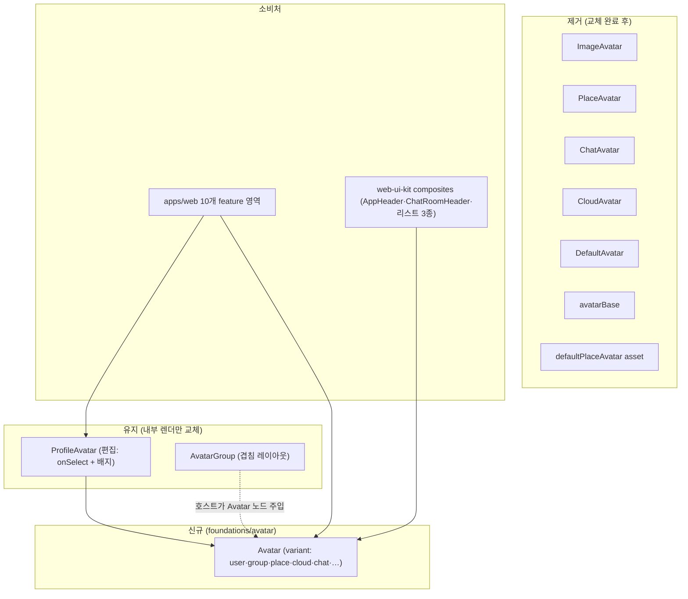

# Avatar — 표시용 아바타 단일 컴포넌트

> 상태: Approved · 최종 갱신: 2026-08-06 · 관련 ADR: [0045](../../../docs/adr/0045-relay-default-place-scoping-profile-step-and-avatar-unification.md) (결정 6)

## 목적

표시용 아바타가 유형별 컴포넌트 7종 + asset 1개로 파편화되어(`ImageAvatar` / `PlaceAvatar` /
`ChatAvatar` / `CloudAvatar` / `DefaultAvatar(user|group)` + `avatarBase` 내부 셸 +
`defaultPlaceAvatar` asset) 링 토큰·사이즈 스케일이 서로 어긋나고 Figma 개정 기준과도 어긋난다.
이를 variant 기반 단일 `Avatar`로 수렴시켜 사진/placeholder 폴백을 컴포넌트 안으로 흡수하고
(현재는 사용처마다 `src ? <ImageAvatar/> : <DefaultAvatar/>` 삼항 반복), 디자인 기준을 Figma
변수로 일원화한다.

## 설계 원칙

- **표시용은 `Avatar` 하나다.** 유형(플레이스·클라우드·그룹방·dm/self·chat placeholder·user)은
  컴포넌트 분화가 아니라 variant다. 사진(src) 유무 폴백도 Avatar가 소유한다.
- **통합 경계 — 편집과 레이아웃은 별개다.** `ProfileAvatar`(사진 선택 버튼)와
  `AvatarGroup`(겹침 레이아웃)은 성격이 달라 컴포넌트로 유지하되, 내부의 원형 렌더는 새
  `Avatar`를 쓴다(ADR-0045 결정 6).
- **색·크기는 Figma 변수에서 온다.** 화면에 hex·매직넘버를 박지 않는다(web-ui-kit 우선 원칙,
  ADR-0013). 기존 컴포넌트 간 어긋난 토큰(링: `border-avatar-ring` vs `border-border`, 사이즈
  스케일 충돌)은 Figma 기준으로 단일화한다.
- **파급은 apps/web + web-ui-kit composites로 한정된다.** desktop-web은 web-ui-kit을 쓰지
  않음을 확인했다(import 0건 — shadcn `@chatic/ui-kit` 별도 스택).

## 범위

**포함**

- `foundations/avatar`에 variant 기반 `Avatar` 신설 (스토리·테스트 포함).
- 표시용 5종 + 내부 셸 + asset 대체·제거: `ImageAvatar`, `PlaceAvatar`, `ChatAvatar`,
  `CloudAvatar`, `DefaultAvatar`, `avatarBase`, `defaultPlaceAvatar` asset(교체 완료 후).
- `ProfileAvatar`·`AvatarGroup` 내부 렌더를 `Avatar` 기반으로 교체(공개 API 유지).
- web-ui-kit composites 소비처 교체: `AppHeader`(CloudAvatar·DefaultAvatar),
  `ChatRoomHeader`(DefaultAvatar), `SelectedAvatarRow`·`InviteLinkCard`·`SelectableUserItem`
  (ProfileAvatar 표시용) + 관련 스토리.
- apps/web 전 사용처 교체 (아래 사용처 매핑).

**제외**

- desktop-web의 `@chatic/ui-kit` avatar 스택(`Avatar`/`AvatarImage`/`AvatarFallback` +
  `avatarColor.ts`) — 별개 시스템, 불변.
- 표시 이름/이니셜의 데이터 정책(어떤 이름을 쓰나) — 호출부 소관.
- 이미지 업로드·리사이즈 파이프라인(`resizeImageToBase64`) — 현행 유지.

## 시나리오 — 사용처 → variant 매핑

apps/web 직접 사용처(렌더 지점 기준)와 간접 사용처(web-ui-kit composites 경유)의 교체 매핑.
현재 컴포넌트별 렌더 지점: ImageAvatar 8 · DefaultAvatar 10 · ProfileAvatar 11(편집 6/표시 5) ·
CloudAvatar 2 · PlaceAvatar 1 · ChatAvatar 1 · AvatarGroup 1.

셀 안의 `/`는 "또는"이다 — 마크다운 표에서 `|`는 열 구분자로 먹히므로 쓰지 않는다.

| 사용처 (feature)                                                                                                      | 현재                                                     | 새 Avatar                                |
| --------------------------------------------------------------------------------------------------------------------- | -------------------------------------------------------- | ---------------------------------------- |
| home `PlaceItem`                                                                                                      | `thumbnail ? ImageAvatar(46) : PlaceAvatar(lg)`          | `variant="place"` + `src`/`name`         |
| home `ChannelList`                                                                                                    | `src ? ImageAvatar(42) : DefaultAvatar(42)`              | `variant="group"` + `src`                |
| home `CloudItem`/`InviteCloudItem`                                                                                    | `CloudAvatar(lg)`                                        | `variant="cloud"` + `name`               |
| home `HomePage` 프로필 메뉴 (36/32, 표시용)                                                                           | `ProfileAvatar`                                          | `variant="user"` + `src`                 |
| channels `MemberListItem`/`ChannelMessageRow`                                                                         | `ImageAvatar : DefaultAvatar`                            | `variant="user"` + `src`                 |
| channels `MemberProfileDialog` (표시용 86)                                                                            | `ProfileAvatar`                                          | `variant="user"` + `src`                 |
| channels `ChannelRoomPage` 헤더 (20 + ring)                                                                           | `ImageAvatar : DefaultAvatar` in `AvatarGroup`           | `variant="user"` + `src` (+ ring 정책 ↓) |
| channels `ChannelSettingsPage`                                                                                        | dm/group `ImageAvatar : DefaultAvatar`, `ChatAvatar(sm)` | `variant="user"` / `"group"` / `"chat"`  |
| place `PlaceChannelManagePage`                                                                                        | `ImageAvatar : DefaultAvatar`                            | `variant="group"` + `src`                |
| invite `InviteAcceptScreen`(표시 86)·`InviteTargetCard`·`InviteChannelRow`·`InviteWaitingPage`                        | `ProfileAvatar` / `DefaultAvatar`                        | `variant="user"` / `"group"`             |
| ui-kit `AppHeader`                                                                                                    | `CloudAvatar(lg)`, `DefaultAvatar(36)`                   | `variant="cloud"`, `variant="user"`      |
| ui-kit `ChatRoomHeader`                                                                                               | `DefaultAvatar(42, user 또는 group)`                     | `variant="user"` / `"group"`             |
| ui-kit `SelectedAvatarRow`(48)·`InviteLinkCard`(44)·`SelectableUserItem`(42)                                          | `ProfileAvatar` 표시용                                   | `variant="user"` / `"group"` + `src`     |
| 편집용 6곳 (CreatePlaceDialog·CreateChannelDialog·PlaceProfileForm·UpdateChannelDialog·PlaceInfoPage·ProfileEditPage) | `ProfileAvatar` + `onSelect`                             | `ProfileAvatar` 유지 (내부만 Avatar)     |

dm/self 구분(Figma 3451-21343)은 노드 확인 후 `variant` 추가 여부를 확정한다(self가 user와
글리프만 다르면 variant, 구조가 다르면 별도 검토).

## 다이어그램



## 상세 구현

### API 초안 (Figma 확정 전)

```tsx
// foundations/avatar/Avatar.tsx
type AvatarVariant = 'user' | 'group' | 'place' | 'cloud' | 'chat'; // + self? (Figma 3451 확인 후)

interface AvatarProps {
    variant: AvatarVariant;
    /** 사진 URL. 있으면 variant placeholder 대신 사진을 원형 클립으로 렌더. */
    src?: string;
    /** place: 첫 글자 이니셜, cloud: 이니셜 + name-hash 팔레트의 소스. */
    name?: string;
    /** px 단위. Figma 확정 후 주요 크기의 토큰 별칭(sm/md/lg) 재도입 여부 결정. */
    size?: number;
    alt?: string;
    className?: string;
}
```

- 폴백 순서: `src` → variant별 placeholder(글리프/이니셜). 현재 앱 전반의
  `src ? <ImageAvatar/> : <DefaultAvatar/>` 삼항을 전부 흡수한다.
- `cloud`의 8색 name-hash 팔레트([CloudAvatar.tsx](../src/foundations/avatar/CloudAvatar.tsx))는
  Figma 3037-19916 기준으로 유지/개정 여부 확정.
- ring: `AvatarGroup` 호스트가 붙이던 `ring-2 ring-surface`(ChannelRoomPage)를 Avatar prop으로
  흡수할지, 지금처럼 호스트 책임으로 둘지 — Figma 그룹방 노드(3158-26215) 기준으로 결정.

### 해소해야 할 기존 불일치 (Figma가 정본)

- **링 토큰**: `AvatarShell`·`ProfileAvatar`는 `border-avatar-ring`, `DefaultAvatar`만
  `border-border`.
- **사이즈 스케일**: `ChatAvatar`(sm/md/lg = 36/46/56)가 `PlaceAvatar`·`CloudAvatar`(36/40/46)와
  충돌 — 단일 숫자 `size`로 통일하고 토큰 별칭은 Figma 크기 체계 확인 후 결정.
- **`defaultPlaceAvatar` asset**: `` URL로 물려 CSS 변수가 상속되지 않는 폴백 색 문제.
  Figma 플레이스 placeholder로 대체 검토(사용처 1곳 — CreatePlaceDialog `defaultImage`).
- **타입 버그(통과 수리)**: `ManageChannelItem.stories.tsx:38`의 `variant="self"`는
  `DefaultAvatarProps`에 없는 값 — 교체 시 함께 정리.

### 마이그레이션 순서

1. Figma 노드 6묶음(ADR-0045 결정 6의 링크) 판독 → variant 세트·크기 체계·토큰 확정 → 이 문서
   갱신.
2. `Avatar` 구현 + 스토리 + 테스트 (기존 7종은 아직 그대로 — 공존 기간).
3. `ProfileAvatar`·`AvatarGroup` 내부 렌더 교체 (공개 API 불변 — 사용처 무영향).
4. web-ui-kit composites 교체 (AppHeader·ChatRoomHeader·리스트 3종 + 스토리).
5. apps/web feature별 교체 (home → channels → place → invite → mypage 순, 테스트 mock 동반
   갱신).
6. 구 컴포넌트 5종 + `avatarBase` + (가능 시) `defaultPlaceAvatar` asset 삭제, 배럴·스토리·
   테스트 정리.

## 검증 방법

- **web-ui-kit**: `Avatar` 유닛 테스트(variant별 placeholder·src 폴백·이니셜·팔레트),
  기존 7종 테스트는 교체 완료 시점에 Avatar 테스트로 대체. Storybook에서 variant 매트릭스
  시각 확인. `nx typecheck web-ui-kit` 그린.
- **apps/web**: 교체 대상 파일의 기존 테스트(mock 갱신 포함) 전부 통과. import 잔존 검사
  (`grep`으로 구 컴포넌트 참조 0건 확인 후 삭제).
- **시각 대조**: Figma 노드별(플레이스 4 · 프로필 3 · 클라우드 1 · 그룹방 1 · dm/self 1)
  스크린샷 대조 — 배포 환경 QA 병행.

---

## 구현 체크리스트 (임시 — Live 전환 시 삭제)

1. **Figma 판독 (선행 조건 — ⛔ 블로킹 중)** — Figma 데스크톱 앱에서 DoU 파일 열기 + Dev Mode
   MCP Server 활성화 필요(2026-08-06 두 차례 시도, 서버 비활성 확인). 노드: 플레이스
   3700-11621 · 3769-34384 · 3700-11935 ·
   3408-27532, 프로필 3644-58498 · 3408-27063 · 2981-16916, 클라우드 3037-19916, 그룹방
   3158-26215, dm/self 3451-21343. 판독 결과로 variant 세트·size 체계·링/배경 토큰 확정 →
   이 문서의 API 초안 갱신.
2. `Avatar` + 스토리 + 테스트 (`foundations/avatar/Avatar.tsx`).
3. `ProfileAvatar` 내부 교체(폴백 4단·group 배경·`defaultImage` 경로 흡수 확인) +
   `AvatarGroup` 스토리의 노드 교체.
4. composites 교체: `AppHeader.tsx:104,147` · `ChatRoomHeader.tsx:105` ·
   `SelectedAvatarRow.tsx:42` · `InviteLinkCard.tsx:34` · `SelectableUserItem.tsx:41` + 스토리.
5. apps/web 교체 (사용처 매핑 표 순서, 테스트 mock 동반).
6. 구 컴포넌트·asset·배럴 정리 + `variant="self"` 스토리 타입 버그 수리.

## 리스크와 미지수 (임시 — Live 전환 시 삭제)

- **Figma 접근이 선행 조건이다.** Dev Mode MCP Server가 비활성이면 1번이 막힌다 — 사용자
  액션 필요(파일 열기 + 설정 활성화). 판독 전까지 API 초안의 variant·size는 잠정.
- **사이즈 회귀.** 기존 사용처가 46/42/40/36/32/20 등 숫자 크기를 직접 쓰므로, 토큰 별칭
  도입 시 근사 매핑에서 1~2px 회귀가 날 수 있다 — Figma 크기 체계와 대조 후 숫자 유지/토큰화
  결정.
- **AvatarGroup 링 정책.** 호스트 책임(현행) vs Avatar prop 흡수 — 결정에 따라
  ChannelRoomPage 헤더 마크업이 달라진다.
- **테스트 mock 광범위 갱신.** apps/web 테스트 9개 파일이 구 컴포넌트를 mock — 교체 순서와
  같은 커밋에서 갱신해야 CI가 계속 그린이다.
